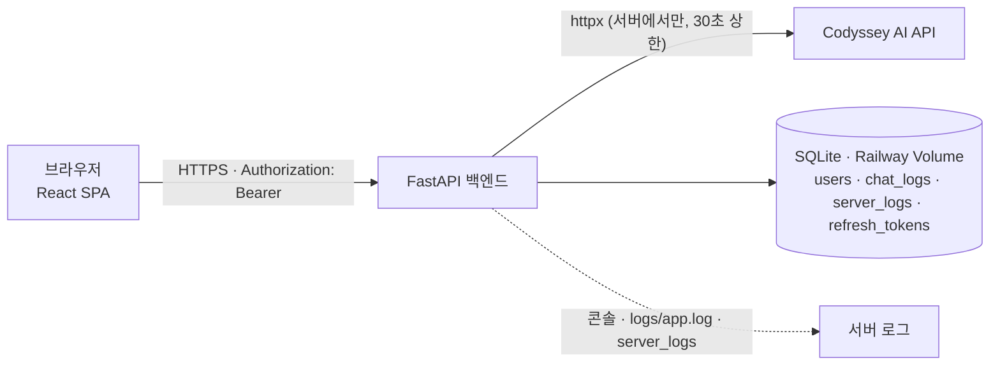
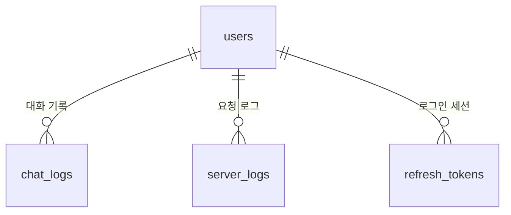

# Chatlog — 웹 기반 AI 챗봇 서비스

로그인한 사용자의 질문에 AI 가 답하고, 모든 질문·응답을 **사용자 기준으로 저장·조회**할 수 있는 웹 챗봇입니다.
AI 장애(타임아웃·호출 실패)가 나도 서비스는 멈추지 않고 사용자에게 원인을 안내하며, 서버 로그로 원인을 추적할 수 있습니다.

| 항목 | 내용 |
|------|------|
| **서비스 URL** | https://b7-1-chatbot-fe-production.up.railway.app/ |
| **GitHub Repository** | https://github.com/b7-1-chatbot-team/B7-1-chatbot |
| **팀** | 성원모(팀장, 백엔드) · 이성준(프론트엔드) — 박성현 2026-09-23 중도 이탈 |

---

## 1. 프로젝트 개요

### 문제 정의
기술 학습자는 공부하다 막히면 검색과 질문을 반복합니다. 일반 챗봇은 **대화 기록이 계정 단위로 남지 않고**, 장애가 나면 이유를 알 수 없으며, 무엇을 물어봤는지 **나중에 다시 추적하기 어렵습니다.**
Chatlog 는 질문·응답을 사용자 기준으로 누적 저장해 언제든 다시 볼 수 있게 하고, AI 장애 시에도 서비스를 유지하며 원인을 안내합니다.

### 타겟 사용자
| 사용자 | 상황 | 원하는 것 |
|--------|------|-----------|
| 학습자 | 프로젝트 중 막힘 | 이어서 묻는 질문에도 맥락을 기억하는 답변, 지난 대화 다시 보기 |
| 평가자·팀원 | 요구사항 검증 | 가입 → 로그인 → 질문 → 응답 → 기록 확인, 장애 상황 확인 |
| 운영자(관리자) | AI API 가 느려지거나 실패 | 사용자별 대화·AI 실패 기록·요청 흐름으로 어느 구간에서 실패했는지 추적 |

### 핵심 시나리오
1. **가입·로그인** — 이메일·비밀번호·닉네임으로 가입 → 로그인하면 챗 화면으로 이동
2. **문맥이 이어지는 대화** — 질문 → AI 답변. "내가 방금 뭘 물어봤지?" 에도 **최근 5턴**을 기억해 답한다
3. **대화 기록 조회** — "내 대화 로그" 에서 내 질문·답변을 다시 본다 (다른 사용자 기록은 볼 수 없음)
4. **AI 장애** — AI 응답이 30초를 넘기면 `504`, 호출이 실패하면 `502`. 서버는 멈추지 않고 안내 문구와 [다시 시도] 를 보여 준다
5. **관리자 추적** — 관리자 화면에서 통계·사용자별 대화·AI 실패 기록·요청별 처리 단계(로그)를 확인

자세히: [docs/01-scenario.md](docs/01-scenario.md)

---

## 2. 기술 스택

| 영역 | 스택 |
|------|------|
| Backend | Python · **FastAPI** · SQLAlchemy 2.0 · **SQLite** · PyJWT(HS256) · bcrypt · httpx(비동기) |
| AI | **Codyssey AI API** (서버에서만 호출, 키는 환경변수) |
| Frontend | **React 19** · TypeScript(strict) · Vite · React Router 7 · axios · CSS Modules |
| 인증 | JWT access token(15분) + refresh token(1일, 재발급마다 회전) — `Authorization: Bearer` 헤더 |
| 테스트 | pytest(백엔드) · Vitest + Testing Library + MSW(프론트) |
| 배포 | **Railway 서비스 2개**(프론트·백엔드 별도 도메인, HTTPS), SQLite 는 Volume `/data` |

---

## 3. 시스템 구조



| 구성 요소 | 역할 |
|-----------|------|
| **프론트 (React)** | 화면(로그인·가입·챗·내 대화 로그·관리자), 라우팅 가드, 토큰 저장·자동 재발급(axios 인터셉터), 응답 봉투 해석, 오류 안내 |
| **백엔드 라우터** (`routers/`) | `auth`(가입·로그인·재발급·로그아웃·현재 사용자) · `chat`(질문) · `me`(내 대화 로그) · `admin`(관리자 조회 5종) |
| **서비스** (`services/`) | 인증(bcrypt·JWT·refresh 회전) · AI 호출(컨텍스트 구성·타임아웃·실패 분류) |
| **CRUD·모델** (`crud/`·`models/`) | DB 접근, 테이블 정의 |
| **공통** (`core/`) | 공통 응답 봉투 `{code, data}`·예외 변환, 인증 의존성(`get_current_user`·`require_admin`), 이벤트 로그 |
| **정적 서버** (`frontend/Caddyfile`) | 빌드 결과 서빙·SPA fallback·보안 응답 헤더(CSP·HSTS·클릭재킹 방지 등) |

**질문 한 건의 처리 흐름** — 요청 수신 → 인증 → 입력 검증(1~1000자) → 최근 5턴으로 컨텍스트 구성 → AI 호출(30초 상한) → 성공·실패 모두 DB 저장 → `{code, data}` 응답. 단계마다 같은 `request_id` 로 서버 로그가 남습니다 (`request_received → ai_call_start → ai_call_success / ai_call_failed → db_save_success`).

자세히: [docs/02-architecture.md](docs/02-architecture.md)

---

## 4. API 명세

모든 응답은 **HTTP 200** 이고, 결과는 본문의 `code` 로 판단합니다: `{ "code": 200, "data": { ... } }`

| Method | Path | 인증 | 설명 |
|--------|------|:----:|------|
| POST | `/api/auth/signup` | – | 회원가입 (성공 `code: 201`) |
| POST | `/api/auth/login` | – | 로그인, access·refresh token 발급 |
| POST | `/api/auth/refresh` | – | 토큰 재발급 (body 에 refresh token) |
| POST | `/api/auth/logout` | – | 로그아웃, refresh token 폐기 |
| GET | `/api/auth/me` | ✅ | 현재 사용자 (`role` 포함) |
| POST | `/api/chat` | ✅ | 질문 → AI 응답 (+ DB 저장) |
| GET | `/api/me/chats` | ✅ | 내 대화 로그 (`limit`·`offset`) |
| GET | `/api/admin/stats` | 🔒 | 전체 요약 통계 |
| GET | `/api/admin/users` | 🔒 | 사용자 목록·이메일 검색 |
| GET | `/api/admin/users/{user_id}/chats` | 🔒 | 사용자별 대화 |
| GET | `/api/admin/failures` | 🔒 | AI 실패 기록 |
| GET | `/api/admin/requests/{request_id}/logs` | 🔒 | 요청 한 건의 처리 단계 로그 |

✅ 로그인 필요 · 🔒 관리자(`role=admin`) 필요

**예시 — 질문 전송**
```http
POST /api/chat
Authorization: Bearer <access_token>
Content-Type: application/json

{ "message": "FastAPI에서 CORS 설정은 어떻게 해?" }
```
```json
{
  "code": 200,
  "data": {
    "chat_id": 987,
    "question": "FastAPI에서 CORS 설정은 어떻게 해?",
    "answer": "FastAPI에서는 CORSMiddleware를 사용합니다...",
    "created_at": "2026-09-14T10:05:12+09:00"
  }
}
```

**주요 결과 코드** — `401` 로그인 필요 · `403` 관리자 아님 · `404` 없음 · `409` 이메일 중복 · `422` 입력 검증 실패 · `500` 서버 오류 · `502` AI 호출 실패 · `504` AI 타임아웃

전체 요청·응답 예시: [docs/03-api.md](docs/03-api.md)

---

## 5. DB 구조



| 테이블 | 용도 | 주요 필드 |
|--------|------|-----------|
| `users` | 계정 | `id`, `email`(고유), `hashed_password`(bcrypt), `nickname`, `role`(user·admin), `created_at` |
| `chat_logs` | 질문·응답 누적 저장 | `user_id`(사용자 식별), `created_at`(생성 시각), `question`, `answer`(실패 시 NULL), `status`(success·error), `error_code`, `latency_ms`, `request_id` |
| `server_logs` | 요청 단계별 이벤트 | `request_id`, `level`, `event`, `user_id`, `detail`, `created_at` |
| `refresh_tokens` | 재발급용 토큰 | `user_id`, `token_hash`(SHA-256, 원문 저장 안 함), `expires_at` |

전체 ERD·필드 설명·DDL: [docs/04-database.md](docs/04-database.md)

### DB 확인 방법
1. **로그 조회 API** — `GET /api/me/chats`(내 기록), 관리자 `GET /api/admin/*`(전체 사용자·실패·요청 흐름)
2. **관리자 화면** — 배포 사이트에 관리자 계정으로 로그인 → 통계·사용자별 대화·AI 실패 기록·요청 흐름
3. **확인용 SQL** — 로컬 DB 에서 `sqlite3 backend/data/app.db < backend/scripts/check_logs.sql`

---

## 6. 실행 방법

### 로컬 — 백엔드
```bash
cd backend
python3 -m venv .venv && source .venv/bin/activate
pip install -r requirements-dev.txt
# backend/.env 를 만든다 — 키 목록은 아래 "환경변수" 표 (실제 값은 커밋 금지)
uvicorn app.main:app --reload        # http://localhost:8000/docs (Swagger)
python -m pytest -q                  # 자동 테스트
```

### 로컬 — 프론트엔드
```bash
cd frontend
nvm use                                        # Node 24 (.nvmrc)
npm install
cp .env.development.example .env.development   # 로컬 백엔드 주소
npm run dev                                    # http://localhost:5173
```
백엔드 없이 화면만 볼 때는 `.env.development` 에 `VITE_ENABLE_MOCK=true` (MSW 모킹).

### 배포 — Railway
프론트·백엔드를 Railway **서비스 2개**로 띄웁니다. 백엔드는 Start Command `uvicorn app.main:app --host 0.0.0.0 --port $PORT`, DB 는 Volume `/data`(`DATABASE_URL=sqlite:////data/app.db`). 프론트는 Railpack 이 Vite 빌드 후 `frontend/Caddyfile` 로 서빙합니다.
절차·트러블슈팅: [docs/06-deployment.md](docs/06-deployment.md)

### 환경변수
**백엔드** (`backend/.env`, Railway Variables)

| 키 | 설명 |
|----|------|
| `COPA_API_KEY` | Codyssey AI API 키 — **서버에서만 사용** (민감) |
| `JWT_SECRET_KEY` | JWT 서명 키, 충분히 긴 난수 (민감). 비어 있으면 서버가 시작하지 않음 |
| `JWT_ALGORITHM` · `JWT_EXPIRE_MINUTES` · `REFRESH_TOKEN_EXPIRE_DAYS` | `HS256` · `15` · `1` |
| `DATABASE_URL` | 기본 `sqlite:///./data/app.db`, Railway 는 `sqlite:////data/app.db` |
| `AI_TIMEOUT_SECONDS` · `AI_CONTEXT_TURNS` · `MAX_MESSAGE_LENGTH` | `30` · `5` · `1000` |
| `CORS_ORIGINS` | 허용할 프론트 주소, 쉼표 구분 |
| `ADMIN_EMAIL` · `ADMIN_PASSWORD` · `ADMIN_NICKNAME` | 서버 시작 시 관리자 계정 생성(비밀번호 민감) |
| `LOG_FILE` | 로그 파일 경로, Railway 는 `/data/logs/app.log` |

**프론트** (`frontend/.env.development` · `.env.production`, 예시: `frontend/.env.*.example`)

| 키 | 설명 |
|----|------|
| `VITE_API_BASE_URL` | 백엔드 주소. 배포에서는 보안 헤더 CSP 의 허용 주소로도 쓰인다 |
| `VITE_ADMIN_PATH` | 관리자 화면 주소 (짐작하기 어려운 값, 코드·문서에 적지 않음) |
| `VITE_SITE_URL` | 운영 전용 — 배포된 프론트 주소 (sitemap·canonical) |
| `VITE_ENABLE_MOCK` | `true` 면 백엔드 없이 MSW 모킹 (개발 전용) |

전체 설명: [docs/06-deployment.md 3. 환경변수](docs/06-deployment.md#3-환경변수)

---

## 7. 민감정보 관리
- **키·비밀번호는 환경변수로만** 다룹니다. 코드·문서에 값을 적지 않고, AI 키는 서버에서만 써서 프론트 번들에 들어가지 않습니다(배포 번들 검사로 확인).
- **`.env` 는 커밋하지 않습니다.** 루트 `.gitignore` 에 `.env`·`.env.*`·`*.db`·`node_modules/`·`dist/` 가 있고, 프론트는 값이 빈 예시 파일(`frontend/.env.*.example`)만 저장소에 둡니다. 백엔드 키 목록은 위 표와 docs/06 이 기준입니다.
- **git 전체 이력**에서 비밀값 패턴을 검색해 남은 것이 없음을 확인했습니다.
- 보안 점검·침투 테스트 결과: [docs/13-security-review.md](docs/13-security-review.md)

---

## 8. 팀 구성원 역할 및 개인별 작업 요약

| 팀원 | 역할 | 주요 작업 |
|------|------|-----------|
| **성원모** (팀장) | 백엔드 전체 | 백엔드 기본 구성 · DB 모델/CRUD · JWT 인증(재발급 회전·관리자 시드) · 내 대화 로그 API · 챗 API(Codyssey AI 호출·컨텍스트·실패 처리) · 서버 로그 · 관리자 API 5종과 감사 로그 · 동시 요청 시 서버 멈춤 수정 · Railway 배포 설정 |
| **이성준** | 프론트엔드 전체 | React·TypeScript 구성 · 가입/로그인/챗/내 대화 로그/관리자 화면 · 인증 상태·자동 재발급·탭 간 로그아웃 · 공통 응답·오류 안내(429 포함) · 디자인 시스템·반응형·접근성·SEO · 첫 화면 성능(Lighthouse 모바일 99) · 정적 서버 보안 헤더(CSP 등) · 배포 통합 테스트·보안 점검·침투 테스트 |
| 박성현 | (2026-09-23 중도 이탈) | 이탈 전 담당이던 AI 파이프라인·관리자 API 는 성원모가 인수 |

커밋 수·PR 은 [docs/09-team.md](docs/09-team.md) 6절에 기록합니다 (`git shortlog -sn --no-merges`).

---

## 9. 문서

| 문서 | 내용 |
|------|------|
| [01-scenario](docs/01-scenario.md) | 문제 정의·타겟·시나리오 |
| [02-architecture](docs/02-architecture.md) | 시스템 구조·인증 방식·처리 흐름 |
| [03-api](docs/03-api.md) | API 명세(요청·응답 예시, 결과 코드) |
| [04-database](docs/04-database.md) | ERD·테이블·DB 확인 방법 |
| [05-ui-ux](docs/05-ui-ux.md) | 화면 설계·디자인 시스템 |
| [06-deployment](docs/06-deployment.md) | 실행·배포·환경변수 |
| [07-verification](docs/07-verification.md) | 검증 계획·결과 |
| [08-checklist](docs/08-checklist.md) | 미션 요구사항 대조 |
| [09-team](docs/09-team.md) | 팀 운영 규칙·역할·작업 요약 |
| [12-decisions](docs/12-decisions.md) | 주요 결정과 근거 |
| [13-security-review](docs/13-security-review.md) | 보안 점검·침투 테스트 |
| [backend/README](backend/README.md) · [frontend/README](frontend/README.md) · [frontend/TESTING](frontend/TESTING.md) | 각 영역 상세·테스트 기록 |
