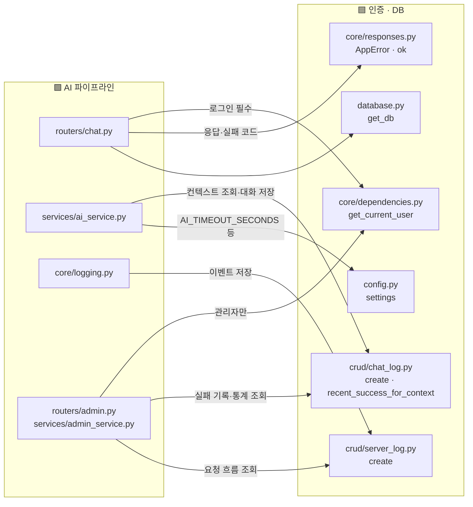

# Backend 프로젝트 구조 (담당별)

> FastAPI · SQLAlchemy 2.0 · SQLite · JWT · httpx
> 기준 문서: [docs/02-architecture.md](../docs/02-architecture.md) · [docs/09-team.md](../docs/09-team.md) · [docs/11-open-issues.md](../docs/11-open-issues.md)
> 관리자 API(B15~B19)는 박성현 담당으로 조정 (기존 담당 미정 G7)

## 범례

| 표시 | 담당 |
|:----:|------|
| 🟦 | **성원모** — 인증 · DB · 인프라 |
| 🟩 | **박성현** — AI 파이프라인 · 관리자 API |
| 🟨 | 공용 파일 — 수정 시 채널 공지 (09-team) |

| 상태 | 의미 |
|:----:|------|
| ✅ | develop 머지 완료 |
| 🔄 | 구현 완료, PR 대기 (`feature/*` 브랜치) |
| ⏳ | 예정 |

---

## 1. 전체 파일 구조

```
backend/
├── app/
│   ├── __init__.py
│   ├── main.py                  🟨 앱 진입점 — CORS · 예외 핸들러 · 라우터 등록 · lifespan
│   ├── config.py                🟦 환경변수 로딩 (pydantic-settings)
│   ├── database.py              🟦 엔진 · 세션 · Base · get_db
│   │
│   ├── core/                    ── 공통 기반
│   │   ├── responses.py         🟦 공통 응답 {code, data} · AppError · 예외 → 봉투 변환
│   │   ├── timeutil.py          🟦 UTC 저장 / +09:00 응답 변환
│   │   ├── security.py          🟦 bcrypt · JWT 발급/검증 · refresh token 해시
│   │   ├── dependencies.py      🟦 get_current_user(401) · require_admin(403)
│   │   └── logging.py           🟩 구조화 로그 · request_id · server_logs 기록
│   │
│   ├── models/                  ── 테이블 정의 (SQLAlchemy)
│   │   ├── user.py              🟦 users
│   │   ├── chat_log.py          🟦 chat_logs
│   │   ├── server_log.py        🟦 server_logs
│   │   └── refresh_token.py     🟦 refresh_tokens
│   │
│   ├── crud/                    ── DB 질의 전담 (라우터는 DB 직접 접근 금지)
│   │   ├── user.py              🟦 get · get_by_email · create   (+ 🟩 list_with_stats · count)
│   │   ├── chat_log.py          🟦 create · recent_success_for_context · 내 로그 count/list
│   │   │                           (+ 🟩 list_for_user · list_failures · stats)
│   │   ├── refresh_token.py     🟦 create · get_valid · delete · delete_expired
│   │   └── server_log.py        🟦 create   (+ 🟩 list_by_request)
│   │
│   ├── schemas/                 ── 요청·응답 검증 (Pydantic)
│   │   ├── auth.py              🟦 SignupRequest · LoginRequest · RefreshTokenRequest
│   │   ├── chat.py              🟩 ChatRequest(1~1000자) · 챗 응답
│   │   └── admin.py             🟩 관리자 응답
│   │
│   ├── services/                ── 비즈니스 로직
│   │   ├── auth_service.py      🟦 가입 · 로그인 · 재발급(회전) · 로그아웃 · 관리자 시드 · 만료 토큰 정리
│   │   ├── ai_service.py        🟩 컨텍스트 구성 · Codyssey AI 호출 · 타임아웃 504 / 실패 502
│   │   └── admin_service.py     🟩 통계 · 사용자 목록 · 사용자별 대화 · 실패 기록 · 요청 흐름
│   │
│   └── routers/                 ── HTTP 엔드포인트
│       ├── auth.py              🟦 /api/auth/signup · login · refresh · logout · me
│       ├── me.py                🟦 /api/me/chats
│       ├── chat.py              🟩 /api/chat
│       └── admin.py             🟩 /api/admin/*
│
├── scripts/
│   └── check_logs.sql           🟦 평가자용 DB 확인 SQL
│
├── tests/
│   ├── conftest.py              🟦 임시 DB · TestClient · 헬퍼
│   ├── test_auth.py             🟦 인증 19개
│   ├── test_me_chats.py         🟦 내 로그 4개
│   └── test_chat.py             🟩 챗 파이프라인 (AI 클라이언트 목)
│
├── requirements.txt             🟨 런타임 의존성
├── requirements-dev.txt         🟦 pytest
├── pytest.ini                   🟦 테스트 설정
├── .env                         (커밋 금지 — 각자 작성)
└── main.py                      🟩 기존 AI PoC — chat.py 이관 후 삭제 예정
```

---

## 2. 담당별 파일 · 진행 상태

### 🟦 성원모 — 인증 · DB · 인프라

| 영역 | 파일 | 이슈 / 브랜치 | 상태 |
|------|------|---------------|:----:|
| 기본 구성 | `main.py`(CORS·예외 핸들러), `config.py`, `core/responses.py`, `requirements.txt`, 루트 `.gitignore` | #10 · PR #15 | ✅ |
| DB | `database.py`, `core/timeutil.py`, `models/*`, `crud/*`, `scripts/check_logs.sql` | #11 · PR #17 | 🔄 |
| 인증 | `core/security.py`, `core/dependencies.py`, `schemas/auth.py`, `services/auth_service.py`, `routers/auth.py`, `main.py`(lifespan), `tests/test_auth.py` | #16 · `feature/be-auth-jwt` | 🔄 |
| 내 로그 | `routers/me.py`, `tests/test_me_chats.py` | #20 · `feature/be-logs` | 🔄 |
| 배포 | Railway 서비스 설정, `CORS_ORIGINS`, Volume `/data` | `chore/deploy` | ⏳ |
| 문서 | 루트 README 총괄 | `docs/*` | ⏳ |

### 🟩 박성현 — AI 파이프라인 · 관리자 API

| 영역 | 파일 | 상태 |
|------|------|:----:|
| AI 클라이언트 | `services/ai_service.py` — `httpx.AsyncClient`, `COPA_API_KEY`, 호출 전체 30초 상한 | ⏳ |
| 챗 API | `routers/chat.py`, `schemas/chat.py` — `POST /api/chat`, 입력 검증 422 | ⏳ |
| 컨텍스트 | 최근 성공 Q/A 5개 (`AI_CONTEXT_TURNS`) | ⏳ |
| 실패 처리 | 타임아웃 504 · 호출 실패 502, 실패도 `chat_logs` 저장, 자동 재시도 없음 | ⏳ |
| 로깅 | `core/logging.py` — `request_id`, 이벤트 4종을 로그 + `server_logs` 에 기록 | ⏳ |
| PoC 정리 | `backend/main.py` → `routers/chat.py` 이관 후 삭제, `requests` 제거 | ⏳ |
| 관리자 API | `routers/admin.py`, `services/admin_service.py`, `schemas/admin.py` — `GET /api/admin/stats` · `/users` · `/users/{id}/chats` · `/failures` · `/requests/{request_id}/logs` | ⏳ |
| 관리자 조회 CRUD | `crud.user.list_with_stats`·`count`, `crud.chat_log.list_for_user`·`list_failures`·`stats`, `crud.server_log.list_by_request` | ⏳ |

> 관리자 API 는 `require_admin` 의존성(403)과 관리자 계정 시드(`ensure_admin`)를 사용한다 — 이 두 가지는 인증 트랙(🟦)에서 이미 구현됨.

---

## 3. 두 트랙이 만나는 지점



박성현 님이 가져다 쓰는 것:

| 용도 | 사용 방법 | 제공 파일 |
|------|-----------|-----------|
| 로그인 필수 처리 | `user: User = Depends(get_current_user)` → `user.id` 만 사용 | `core/dependencies.py` |
| DB 세션 | `db: Session = Depends(get_db)` | `database.py` |
| 성공 응답 | `return ok({"chat_id": …, "question": …, "answer": …, "created_at": …})` | `core/responses.py` |
| 실패 응답 | `raise AppError(504, "현재 응답이 지연되고 있어요. 잠시 후 다시 시도해 주세요.")` · `raise AppError(502, "…")` | `core/responses.py` |
| 입력 검증 메시지 | 스키마 validator 에서 `raise ValueError("질문은 1~1000자로 입력해 주세요.")` → 자동 422 | `core/responses.py` |
| 컨텍스트 조회 | `crud.chat_log.recent_success_for_context(db, user.id, settings.ai_context_turns)` — **오래된 순**으로 반환 | `crud/chat_log.py` |
| 대화 저장 | `crud.chat_log.create(db, user_id=…, question=…, answer=…, status="success"/"error", error_code=…, latency_ms=…, request_id=…)` | `crud/chat_log.py` |
| 서버 로그 저장 | `crud.server_log.create(db, request_id=…, level="INFO", event="ai_call_start", user_id=…, detail="…")` | `crud/server_log.py` |
| 설정값 | `settings.copa_api_key` · `ai_timeout_seconds` · `ai_context_turns` · `max_message_length` | `config.py` |
| 응답 시각 형식 | `to_kst_iso(log.created_at)` | `core/timeutil.py` |
| 관리자 권한 | `admin: User = Depends(require_admin)` → 비로그인 401 · 일반 사용자 403 | `core/dependencies.py` |
| 관리자 계정 | 백엔드 `.env` 의 `ADMIN_EMAIL`·`ADMIN_PASSWORD` 로 서버 시작 시 자동 생성 | `services/auth_service.py` |

---

## 4. 공용 파일 수정 규칙 🟨

| 파일 | 누가 무엇을 추가하나 | 충돌 방지 |
|------|----------------------|-----------|
| `app/main.py` | 🟦 CORS·lifespan·`auth`/`me` 라우터 · 🟩 `chat.router`·`admin.router` 등록 · 🟩 request_id 미들웨어 | 라우터 등록 줄만 추가, 수정 전 채널 공지 |
| `requirements.txt` | 🟦 기본 의존성 · 🟩 PoC 삭제 시 `requests` 제거 | 버전 변경 시 공지 |
| `.env` 키 | 🟦 JWT·DB·CORS·ADMIN_* · 🟩 COPA_API_KEY·AI_* | 키 목록은 docs/06-deployment 이 기준 |

---

## 5. 요청 처리 흐름 한눈에

```
브라우저 ─HTTPS─▶ app/main.py (CORS · 예외 핸들러)
                   │
                   ├─ /api/auth/*   ─▶ routers/auth.py ─▶ services/auth_service.py ─▶ crud ─▶ SQLite      🟦
                   ├─ /api/me/chats ─▶ routers/me.py   ─(get_current_user)────────▶ crud ─▶ SQLite      🟦
                   ├─ /api/chat     ─▶ routers/chat.py ─(get_current_user)─▶ services/ai_service.py       🟩
                   │                                         ├─▶ crud.chat_log (컨텍스트·저장) ─▶ SQLite
                   │                                         └─▶ Codyssey AI API (httpx, 30초)
                   └─ /api/admin/*  ─▶ routers/admin.py ─(require_admin)─▶ services/admin_service.py      🟩
```

---

## 6. 실행

```bash
cd backend
python3 -m venv .venv && source .venv/bin/activate
pip install -r requirements-dev.txt
# backend/.env 작성 — 키 목록: docs/06-deployment.md (JWT_SECRET_KEY 필수)
uvicorn app.main:app --reload        # http://localhost:8000/docs
python -m pytest -q
```
