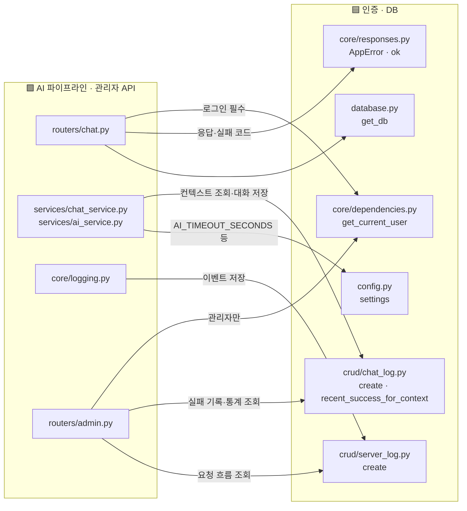

# Backend 프로젝트 구조 (담당별)

> FastAPI · SQLAlchemy 2.0 · SQLite · JWT · httpx
> 기준 문서: [docs/02-architecture.md](../docs/02-architecture.md) · [docs/09-team.md](../docs/09-team.md) · [docs/11-open-issues.md](../docs/11-open-issues.md)
> 2026-09-23 박성현 팀 이탈 → **백엔드 전체를 성원모가 담당** (AI 파이프라인·관리자 API 인수, docs/11-open-issues C10)
> 아래 🟦·🟩 는 담당자가 아니라 **작업 영역** 구분이다 (둘 다 성원모)
> 진행 상태 기준: **2026-10-10 develop** (`pytest -q` 83건 통과 — 인증 30 · 내 로그 4 · 챗 23 · 서버 로그 4 · 관리자 11 · 앱 설정 11)
> 백엔드 API 는 명세의 전 항목(인증 · 챗 · 내 대화 로그 · 관리자 5종 · 서버 로그)이 develop 에 머지됐고, Railway 배포·외부망 확인도 끝났다. 남은 일은 보안 점검 문서의 백엔드 항목([8. 남은 작업](#8-남은-작업))

## 범례

| 표시 | 영역 (담당) |
|:----:|------|
| 🟦 | 인증 · DB · 인프라 (**성원모**) |
| 🟩 | AI 파이프라인 · 관리자 API (**성원모**, 박성현 이탈로 인수) |
| 🟨 | 공용 파일 — 수정 시 채널 공지 (09-team) |

| 상태 | 의미 |
|:----:|------|
| ✅ | develop 머지 완료 |
| 🔄 | 구현 완료, PR 대기 (`feature/*` 브랜치) |
| 🟡 | 일부 구현 / 진행 중 |
| ⏳ | 예정 (파일 미작성) |

---

## 1. 전체 파일 구조

```
backend/
├── app/
│   ├── __init__.py
│   ├── main.py                  🟨 앱 진입점 — CORS · 예외 핸들러 · 라우터 등록 · lifespan
│   ├── config.py                🟦 환경변수 로딩 (pydantic-settings)
│   ├── database.py              🟦 엔진 · 세션 · Base · get_db (SQLite 파일 DB 는 연결 풀 없이 NullPool)
│   │
│   ├── core/                    ── 공통 기반
│   │   ├── responses.py         🟦 공통 응답 {code, data} · AppError · 예외 → 봉투 변환
│   │   ├── timeutil.py          🟦 UTC 저장 / +09:00 응답 변환
│   │   ├── security.py          🟦 bcrypt · JWT 발급/검증 · refresh token 해시
│   │   ├── dependencies.py      🟦 get_current_user(401) · require_admin(403, 🟩 감사 로그 admin_access / admin_forbidden)
│   │   ├── body_limit.py        🟦 요청 본문 크기 상한(413) — 64KB 넘으면 읽지 않고 거절
│   │   ├── rate_limit.py        🟦 요청 횟수 제한(429) — 챗 사용자별 · 로그인 실패 이메일/IP 별 · 가입 IP 별, 실제 IP 읽기
│   │   └── logging.py           🟩 이벤트 로그 — 콘솔 · 파일(logs/app.log) · server_logs 동시 기록 · request_id 발급
│   │
│   ├── models/                  ── 테이블 정의 (SQLAlchemy)
│   │   ├── user.py              🟦 users
│   │   ├── chat_log.py          🟦 chat_logs
│   │   ├── server_log.py        🟦 server_logs
│   │   └── refresh_token.py     🟦 refresh_tokens
│   │
│   ├── crud/                    ── DB 질의 전담 (라우터는 DB 직접 접근 금지)
│   │   ├── user.py              🟦 get · get_by_email · create   + 🟩 관리자: count · list_with_stats
│   │   ├── chat_log.py          🟦 create · recent_success_for_context · 내 로그 count/list
│   │   │                           + 🟩 관리자: stats · count/list_for_user · count/list_failures
│   │   ├── refresh_token.py     🟦 create · get_valid · delete · delete_all_for_user · delete_expired
│   │   └── server_log.py        🟦 create   + 🟩 관리자: list_by_request
│   │
│   ├── schemas/                 ── 요청·응답 검증 (Pydantic)
│   │   ├── auth.py              🟦 SignupRequest · LoginRequest · RefreshTokenRequest
│   │   └── chat.py              🟩 ChatRequest(1~1000자)
│   │
│   ├── services/                ── 비즈니스 로직
│   │   ├── auth_service.py      🟦 가입 · 로그인 · 재발급(회전) · 로그아웃 · 관리자 시드(1명 유지 · 비밀번호 동기화) · 만료 토큰 정리
│   │   ├── chat_service.py      🟩 챗 흐름 — 컨텍스트 구성 · AI 호출 · 성공/실패 저장 · 504 / 502
│   │   └── ai_service.py        🟩 Codyssey AI 호출 · 전체 30초 상한 · 실패 분류(AI_TIMEOUT / AI_CALL_FAILED)
│   │
│   └── routers/                 ── HTTP 엔드포인트
│       ├── auth.py              🟦 /api/auth/signup · login · refresh · logout · me
│       ├── me.py                🟦 /api/me/chats
│       ├── chat.py              🟩 /api/chat
│       └── admin.py             🟩 /api/admin/* — 통계 · 사용자 목록 · 사용자별 대화 · 실패 기록 · 요청 흐름 (조회 전용)
│
├── scripts/
│   └── check_logs.sql           🟦 평가자용 DB 확인 SQL
│
├── tests/
│   ├── conftest.py              🟦 임시 DB · TestClient · 헬퍼
│   ├── test_auth.py             🟦 인증 19개
│   ├── test_me_chats.py         🟦 내 로그 4개
│   ├── test_chat.py             🟩 챗 API 21개 + 서버 로그 4개 (가짜 AI 서버로 대체)
│   └── test_admin.py            🟩 관리자 API·감사 로그 11개
│
├── requirements.txt             🟨 런타임 의존성
├── requirements-dev.txt         🟦 pytest
├── pytest.ini                   🟦 테스트 설정
├── logs/app.log                 (실행 중 생성되는 이벤트 로그, 커밋 제외)
├── app.db 또는 data/app.db      (로컬 SQLite, DATABASE_URL 이 정하는 위치, 커밋 제외)
└── .env                         (커밋 금지 — 각자 작성)
```

---

## 2. 영역별 파일 · 진행 상태

### 🟦 인증 · DB · 인프라 (성원모)

| 영역 | 파일 | 이슈 / 브랜치 | 상태 |
|------|------|---------------|:----:|
| 기본 구성 | `main.py`(CORS·예외 핸들러), `config.py`, `core/responses.py`, `requirements.txt`, 루트 `.gitignore` | #10 · PR #15 | ✅ |
| DB | `database.py`, `core/timeutil.py`, `models/*`, `crud/*`, `scripts/check_logs.sql` | #11 · PR #17 | ✅ |
| 인증 | `core/security.py`, `core/dependencies.py`, `schemas/auth.py`, `services/auth_service.py`, `routers/auth.py`, `main.py`(lifespan), `tests/test_auth.py` | #16 · PR #25 | ✅ |
| 동시 요청 | `database.py` — SQLite 파일 DB 는 연결 풀 없이(NullPool) 사용. 동시 챗 15건에서 서버 전체가 멈추던 교착 수정, 회귀 테스트 | #72 · PR #74 | ✅ |
| 관리자 시드 보강 | `services/auth_service.py`, `crud/refresh_token.py` — `ADMIN_EMAIL` 이 아닌 관리자는 강등(관리자 1명), 관리자 비밀번호를 `ADMIN_PASSWORD` 로 맞추고 바뀌면 refresh 토큰 폐기 | #84 · PR #85 | ✅ |
| 요청 횟수 제한 | `core/rate_limit.py`, `routers/auth.py`, `routers/chat.py`, `config.py` — 챗 사용자별 1분 10회 · 로그인 실패 이메일별 10분 5회/IP 별 20회 · 가입 IP 별 10분 20회 → 429 | #86 · PR #87 | ✅ |
| API 문서 노출 | `config.py`, `main.py`, `tests/test_app.py` — `ENABLE_DOCS=true` 일 때만 `/docs` · `/redoc` · `/openapi.json` 을 연다(기본 꺼짐, 운영 404) | #90 · PR #91 | ✅ |
| 요청 본문 크기 | `core/body_limit.py`, `main.py`, `schemas/auth.py`, `tests/test_app.py` — 본문 64KB 넘으면 읽지 않고 413, 비밀번호 최대 128자(가입·로그인 422) | #92 · PR #93 | ✅ |
| 서명 키 강도 | `main.py`, `tests/test_app.py` — `JWT_SECRET_KEY` 가 비었거나 32바이트 미만이면 서버 시작 거부 | #이슈번호 · PR #번호 | ✅ |
| 내 로그 | `routers/me.py`, `tests/test_me_chats.py` | #58 · PR #59 | ✅ |
| 배포 | Railway 서비스 설정, Volume `/data`, Variables(`DATABASE_URL=sqlite:////data/app.db` · `LOG_FILE=/data/logs/app.log` 등). 공개 도메인 · `CORS_ORIGINS` 등록 · 외부망(HTTPS · 휴대폰 LTE) · 재배포 후 데이터 유지 확인(2026-10-06~07, docs/07-verification L4) | #63 | ✅ |
| 문서 | 루트 README 총괄 | `docs/*` | ✅ |

### 🟩 AI 파이프라인 · 관리자 API (성원모)

| 영역 | 파일 | 상태 |
|------|------|:----:|
| AI 클라이언트 | `services/ai_service.py` — `httpx.AsyncClient`, `COPA_API_KEY`, 호출 전체 30초 상한 | ✅ #61 · PR #62 |
| 챗 API | `routers/chat.py`, `schemas/chat.py`, `services/chat_service.py` — `POST /api/chat`, 입력 검증 422 | ✅ #61 · PR #62 |
| 컨텍스트 | 최근 성공 Q/A 5개 (`AI_CONTEXT_TURNS`) | ✅ #61 · PR #62 |
| 실패 처리 | 타임아웃 504 · 호출 실패 502, 실패도 `chat_logs` 저장, 자동 재시도 없음 | ✅ #61 · PR #62 |
| 로깅 | `core/logging.py` — 챗 요청의 단계별 이벤트(요청 수신 · AI 호출 시작 · AI 성공/실패 · DB 저장 성공/실패)를 콘솔 · `logs/app.log` · `server_logs` 에 같은 `request_id` 로 기록 | ✅ #64 · PR #65 |
| PoC 정리 | `backend/main.py` → `routers/chat.py` 이관 후 삭제, `requests` 제거 | ✅ #61 · PR #62 |
| 관리자 API | `routers/admin.py` — `GET /api/admin/stats` · `/users` · `/users/{id}/chats` · `/failures` · `/requests/{request_id}/logs`. 조회만 하므로 서비스·스키마 파일 없이 라우터 → CRUD 로 바로 연결 (내 대화 로그 API 와 같은 구조) | ✅ #66 · PR #67 |
| 관리자 조회 CRUD | `crud.user.count`·`list_with_stats`, `crud.chat_log.stats`·`count/list_for_user`·`count/list_failures`, `crud.server_log.list_by_request` | ✅ #66 · PR #67 |
| 감사 로그 | `require_admin` 에서 관리자 호출은 `admin_access`, 일반 사용자 시도는 `admin_forbidden`(WARN) 을 콘솔 · 파일 · `server_logs` 에 기록 | ✅ #66 · PR #67 |

> 관리자 API 는 `require_admin` 의존성(403)과 관리자 계정 시드(`ensure_admin`)를 사용한다 — 이 두 가지는 인증 영역(🟦)에서 이미 구현됨.

---

## 3. 두 영역이 만나는 지점


```mermaid
flowchart LR
    subgraph AITRACK["🟩 AI 파이프라인 · 관리자 API"]
        CH[routers/chat.py]
        AI[services/chat_service.py<br/>services/ai_service.py]
        LG[core/logging.py]
        AD[routers/admin.py]
    end
    subgraph AUTHTRACK["🟦 인증 · DB"]
        DEP[core/dependencies.py<br/>get_current_user]
        RESP[core/responses.py<br/>AppError · ok]
        CR[crud/chat_log.py<br/>create · recent_success_for_context]
        SL[crud/server_log.py<br/>create]
        CFG[config.py<br/>settings]
        DB[database.py<br/>get_db]
    end
    CH -->|로그인 필수| DEP
    CH -->|응답·실패 코드| RESP
    CH --> DB
    AI -->|컨텍스트 조회·대화 저장| CR
    AI -->|AI_TIMEOUT_SECONDS 등| CFG
    LG -->|이벤트 저장| SL
    AD -->|관리자만| DEP
    AD -->|실패 기록·통계 조회| CR
    AD -->|요청 흐름 조회| SL
```

AI·관리자 영역(🟩)이 인증·DB 영역(🟦)에서 가져다 쓰는 것:

| 용도 | 사용 방법 | 제공 파일 |
|------|-----------|-----------|
| 로그인 필수 처리 | `user: User = Depends(get_current_user)` → `user.id` 만 사용 | `core/dependencies.py` |
| DB 세션 | `db: Session = Depends(get_db)` | `database.py` |
| 성공 응답 | `return ok({"chat_id": …, "question": …, "answer": …, "created_at": …})` | `core/responses.py` |
| 실패 응답 | `raise AppError(504, "현재 응답이 지연되고 있어요. 잠시 후 다시 시도해 주세요.")` · `raise AppError(502, "…")` | `core/responses.py` |
| 입력 검증 메시지 | 스키마 validator 에서 `raise ValueError("질문은 1~1000자로 입력해 주세요.")` → 자동 422 | `core/responses.py` |
| 컨텍스트 조회 | `crud.chat_log.recent_success_for_context(db, user.id, settings.ai_context_turns)` — **오래된 순**으로 반환 | `crud/chat_log.py` |
| 대화 저장 | `crud.chat_log.create(db, user_id=…, question=…, answer=…, status="success"/"error", error_code=…, latency_ms=…, request_id=…)` | `crud/chat_log.py` |
| 요청 추적 ID | `request_id = new_request_id()` — 12자리, chat_logs·server_logs 를 잇는 열쇠 | `core/logging.py` |
| 서버 로그 저장 | `log_event(request_id, "ai_call_start", user_id=user.id, context_turns=2)` → 콘솔 · 파일 · `server_logs` 에 한 번에 기록 (DB 저장은 내부에서 `crud.server_log.create`) | `core/logging.py` |
| 설정값 | `settings.copa_api_key` · `ai_timeout_seconds` · `ai_context_turns` · `max_message_length` | `config.py` |
| 응답 시각 형식 | `to_kst_iso(log.created_at)` | `core/timeutil.py` |
| 관리자 권한 | `admin: User = Depends(require_admin)` → 비로그인 401 · 일반 사용자 403 | `core/dependencies.py` |
| 관리자 계정 | 백엔드 `.env` 의 `ADMIN_EMAIL`·`ADMIN_PASSWORD` 로 서버 시작 시 자동 생성 | `services/auth_service.py` |

---

## 4. 공용 파일 수정 규칙 🟨

| 파일 | 누가 무엇을 추가하나 | 충돌 방지 |
|------|----------------------|-----------|
| `app/main.py` | 🟦 CORS·lifespan·`auth`/`me` 라우터 · 🟩 `chat.router`·`admin.router` 등록 | 라우터 등록 줄만 추가, 수정 전 채널 공지 |
| `requirements.txt` | 🟦 기본 의존성 (PoC 삭제와 함께 `requests` 제거됨) | 버전 변경 시 공지 |
| `.env` 키 | 🟦 JWT·DB·CORS·ADMIN_* · 🟩 COPA_API_KEY·AI_*·LOG_FILE | 키 목록은 docs/06-deployment 이 기준 |

---

## 5. 요청 처리 흐름 한눈에

```
브라우저 ─HTTPS─▶ app/main.py (CORS · 예외 핸들러)
                   │
                   ├─ /api/auth/*   ─▶ routers/auth.py ─▶ services/auth_service.py ─▶ crud ─▶ SQLite      🟦
                   ├─ /api/me/chats ─▶ routers/me.py   ─(get_current_user)────────▶ crud ─▶ SQLite      🟦
                   ├─ /api/chat     ─▶ routers/chat.py ─(get_current_user)─▶ services/chat_service.py     🟩
                   │                                         ├─▶ crud.chat_log (컨텍스트·저장) ─▶ SQLite
                   │                                         └─▶ services/ai_service.py ─▶ Codyssey AI API (httpx, 30초)
                   └─ /api/admin/*  ─▶ routers/admin.py ─(require_admin + 감사 로그)─▶ crud ─▶ SQLite        🟩

각 단계의 이벤트 ─▶ core/logging.log_event ─▶ 콘솔 · logs/app.log · server_logs (같은 request_id)
```

**챗 요청 한 건의 이벤트 순서** — 관리자 API `GET /api/admin/requests/{request_id}/logs` 가 이 기록을 그대로 돌려준다 (프론트 관리자 화면 "요청 흐름"과의 실서버 연결 확인은 아직)

```
request_received → ai_call_start → ai_call_success / ai_call_failed(reason=…) → db_save_success / db_save_failed
```

---

## 6. API 목록

모든 응답은 HTTP 200 + `{code, data}` 이고, 결과는 `code` 로 구분한다. 실패하면 `data.message` 에 안내 문구가 들어간다.

| Method · 경로 | 로그인 | 설명 | 주요 실패 code |
|---|:-:|---|---|
| `POST /api/auth/signup` | | 회원가입 (성공 201) | 409 이메일 중복 · 422 입력 오류 |
| `POST /api/auth/login` | | access token(15분) · refresh token(1일) 발급 | 401 |
| `POST /api/auth/refresh` | | refresh token 으로 재발급 (기존 refresh token 은 폐기) | 401 |
| `POST /api/auth/logout` | | refresh token 폐기 | — |
| `GET /api/auth/me` | ✅ | 내 정보 · 권한(role) | 401 |
| `POST /api/chat` | ✅ | 질문 → AI 답변 (최근 성공 대화 5개를 함께 보냄) | 422 · 504 AI 지연 · 502 AI 실패 · 500 저장 실패 |
| `GET /api/me/chats` | ✅ | 내 대화 로그 (성공만, 최신순) | 401 |
| `GET /api/admin/stats` | 관리자 | 사용자 수 · 대화 수 · 실패 종류별 건수 · 성공 평균 응답시간 | 401 · 403 |
| `GET /api/admin/users?q=` | 관리자 | 사용자 목록 · 이메일 검색 (최근 활동 순) | 401 · 403 |
| `GET /api/admin/users/{id}/chats` | 관리자 | 사용자별 대화 (성공·실패 모두) | 404 없는 사용자 |
| `GET /api/admin/failures` | 관리자 | AI 실패 기록 | 401 · 403 |
| `GET /api/admin/requests/{request_id}/logs` | 관리자 | 한 요청의 처리 과정(서버 로그) | 404 기록 없음 |

목록 API 는 `limit`(기본 20, 최대 100) · `offset` 을 받고 `{total, items}` 로 응답한다. 요청·응답 예시는 [docs/03-api.md](../docs/03-api.md).

---

## 7. 주요 설계 결정 (왜 이렇게 만들었나)

| 결정 | 이유 |
|------|------|
| AI 호출은 `httpx.AsyncClient` 비동기, 클라이언트 1개 재사용 | AI 응답을 최대 30초 기다리는 동안 다른 사용자 요청을 막지 않기 위해. 요청마다 새 연결(TLS 협상)을 맺지 않아 빠름 |
| 30초 상한을 `asyncio.wait_for` 로 한 번 더 감쌈 | httpx 의 timeout 은 연결·읽기 같은 **단계별** 상한이라, 조금씩 끊어 오는 응답은 전체 30초를 넘을 수 있음 |
| 서버 자동 재시도 없음 | 타임아웃 뒤 재시도하면 사용자가 60초 이상 기다림. 재시도는 화면의 [다시 시도] 버튼으로 사용자가 결정 |
| AI 실패도 `chat_logs` 에 `status=error` 로 저장 | 관리자 화면의 "AI 실패 기록"과 원인 추적이 이 저장분으로 만들어짐 |
| 입력 검증(1~1000자)을 AI 호출 **전**에 수행 | 잘못된 요청으로 AI 비용·대기 시간을 쓰지 않기 위해 |
| 이벤트 로그를 콘솔 · 파일 · DB 세 곳에 기록 | 콘솔은 Railway Logs 화면, 파일은 로컬 `grep`, DB 는 관리자 화면 — 보는 곳마다 같은 기록을 쓰기 위해 |
| `server_logs` 는 요청 세션과 **별도 DB 세션**으로 저장 | 대화 저장이 실패해 요청 세션이 망가져도 `db_save_failed` 는 남기기 위해. 로그 저장이 실패해도 요청은 계속 진행 |
| 로그에 질문 원문 · 비밀번호 · API 키 · 토큰 · DB 예외 메시지를 남기지 않음 | 개인정보·비밀값 유출 방지. 사유는 `timeout`, `auth_failed` 같은 코드와 예외 종류 이름만 |
| 관리자 감사 로그를 `require_admin` 안에서 기록 | 관리자 API 는 모든 사용자의 대화를 볼 수 있으므로 누가 언제 봤는지 남김. 권한 검사와 같은 자리라 경로마다 빠뜨릴 수 없음 |
| 관리자 API 는 서비스·스키마 파일 없이 라우터 → CRUD | 조회만 하므로 중간 계층이 할 일이 없음 (내 대화 로그 API 와 같은 구조). 응답은 필요한 필드만 골라 만들어 비밀번호 해시가 섞이지 않음 |
| 통계의 평균 응답시간은 기록이 없으면 `null` | `0` 으로 두면 "0ms, 아주 빠름"으로 잘못 읽힘. 프론트는 `null` 을 "–" 로 표시하도록 만들어져 있음 (MSW 로만 확인) |
| Railway 에서 `LOG_FILE=/data/logs/app.log` | 컨테이너 안의 파일은 재배포·재시작 때 사라지므로 DB 와 같은 Volume 에 저장 |
| SQLite 파일 DB 는 연결 풀 없이(NullPool) | 기본 풀은 연결을 15개까지만 만든다. 챗 요청은 AI 를 기다리는 동안 연결을 잡고 있어 동시 15건이면 풀이 바닥나 서버 전체가 멈췄다. SQLite 는 파일을 여는 것이라 연결 비용이 작다 |
| 요청 횟수 제한은 메모리 카운터 | 서버가 하나라 Redis 같은 외부 저장소가 필요 없다. 대가는 재시작하면 횟수 초기화. IP 별 로그인 실패 한도를 이메일별(5회)보다 넉넉한 20회로 둔 것은 교육장처럼 여러 사람이 같은 공인 IP 를 쓰기 때문 |
| 실제 IP 는 X-Forwarded-For 의 마지막 값 | Railway 는 실제 접속 IP 를 헤더 끝에 덧붙이고 앞쪽 값은 사용자가 꾸밀 수 있다. uvicorn `--forwarded-allow-ips="*"` 는 맨 앞 값을 써서 IP 제한을 피할 수 있으므로 쓰지 않는다 (`TRUST_FORWARDED_FOR=true`) |
| 관리자 시드가 매 시작마다 계정을 환경변수와 맞춤 | 관리자를 바꿔도 이전 관리자가 남거나, 먼저 가입해 둔 사람의 비밀번호로 관리자가 되거나, 비밀번호 교체가 반영되지 않는 문제를 막기 위해. 시드를 건너뛰는 설정(값 없음)에서는 강등하지 않아 관리자 0명을 막는다 |

---

## 8. 남은 작업

배포 마무리 · 프론트 실서버 연결 · 루트 README 는 끝났다(docs/07-verification L4, 2026-10-06~07). 남은 것은 보안 점검 문서(docs/13-security-review)의 백엔드 항목이다.

| 작업 | 내용 |
|------|------|
| 입력·설정 검증 | bcrypt 비용 코드에 명시(S10) · 비표시 문자 거부(S14) |
| 보안 응답 헤더 | 백엔드 응답에 보안 헤더 5종 (S07, 프론트는 완료) |
| `backend/.env.example` | 값이 비어 있는 키 목록 파일 추가 (실제 값은 커밋 금지) |

------|------|
| 배포 마무리 | 백엔드 공개 도메인 생성 → 프론트 Variables `VITE_API_BASE_URL` · 백엔드 `CORS_ORIGINS` 에 실제 주소 등록 → 외부망에서 가입 · 질문 · 내 대화 로그 · 관리자 화면 전체 흐름 확인 |
| 프론트 실서버 연결 | **아직 안 함.** 백엔드는 pytest 와 Swagger 로만 확인했다. 챗 · 내 대화 로그 · 관리자 화면을 MSW 없이 백엔드에 연결해 확인 (프론트 담당과 함께) |
| `backend/.env.example` | 값이 비어 있는 키 목록 파일 추가 (실제 값은 커밋 금지) |
| 루트 README | 프로젝트 개요 · 실행 방법 · 환경변수 목록 · 팀 역할 정리 |

---

## 9. 실행 · 확인 방법

### 9-1. 설치와 실행

```bash
cd backend
python3 -m venv .venv && source .venv/bin/activate
pip install -r requirements-dev.txt
# backend/.env 작성 — 키 목록: docs/06-deployment.md
#   필수: JWT_SECRET_KEY · COPA_API_KEY
#   관리자 계정: ADMIN_EMAIL · ADMIN_PASSWORD(8자 이상) · ADMIN_NICKNAME → 서버 시작 시 자동 생성
uvicorn app.main:app --reload        # Swagger: http://localhost:8000/docs (backend/.env 에 ENABLE_DOCS=true 일 때)
python -m pytest -q                  # 자동 테스트 83건
```

> `.env` 에 같은 키가 여러 줄 있으면 **아래쪽 값**이 적용된다. 헷갈리지 않게 키마다 한 줄만 둔다.

### 9-2. Swagger 로 확인

> API 문서 화면은 기본으로 꺼져 있다(운영 노출 방지, S03). 로컬에서는 `backend/.env` 에 `ENABLE_DOCS=true` 를 넣고 서버를 다시 켠다.

1. `POST /api/auth/login` 으로 로그인 → 응답의 `access_token` 을 오른쪽 위 **Authorize** 에 붙여 넣기 (`Bearer ` 없이). 토큰은 15분 뒤 만료되므로 그때 다시 로그인
2. 일반 사용자: `POST /api/chat` → `GET /api/me/chats`
3. 관리자(`ADMIN_EMAIL` 로 로그인): `admin` 묶음 5개. `GET /api/admin/failures` 의 `request_id` 를 `GET /api/admin/requests/{request_id}/logs` 에 넣으면 그 요청의 처리 과정이 나온다
4. 일반 사용자 토큰으로 관리자 API 를 부르면 `code: 403`

### 9-3. AI 실패 상황 만들어 보기

서버를 아래처럼 실행하면 그 실행에만 값이 바뀐다 (`.env` 는 그대로).

| 상황 | 실행 | 기대 결과 |
|------|------|-----------|
| AI 타임아웃 | `AI_TIMEOUT_SECONDS=1 uvicorn app.main:app --reload` | `code: 504`, 로그 `ai_call_failed reason=timeout` → `db_save_success status=error` |
| 잘못된 API 키 | `COPA_API_KEY=invalid uvicorn app.main:app --reload` | `code: 502`, 로그 `ai_call_failed reason=auth_failed` → `db_save_success status=error` |

### 9-4. 로그와 DB 확인

| 보는 곳 | 방법 |
|---------|------|
| 콘솔 | 서버를 실행한 터미널 (Railway 는 대시보드 **Logs** 탭) |
| 로그 파일 | `tail -n 20 logs/app.log` · `grep <request_id> logs/app.log` (Railway 는 `/data/logs/app.log`) |
| DB | `.env` 의 `DATABASE_URL` 이 가리키는 파일. 예) `sqlite:///./app.db` 이면 `backend/app.db` |

```bash
sqlite3 app.db "SELECT event, level, detail FROM server_logs WHERE request_id='<request_id>' ORDER BY id;"
sqlite3 app.db "SELECT id, status, error_code, request_id FROM chat_logs ORDER BY id DESC LIMIT 5;"
sqlite3 app.db < scripts/check_logs.sql      # 사용자별 대화 수 · 최근 대화 등 한 번에
```

### 9-5. 로컬 테스트 계정 비밀번호를 잊었을 때

비밀번호는 원래 값으로 되돌릴 수 없는 bcrypt 해시로 저장돼 관리자도 볼 수 없고, 비밀번호 찾기 기능은 없다.
새로 가입하거나, 로컬 DB 에서만 아래처럼 새 비밀번호로 덮어쓴다 (관리자 계정도 같음 — 서버 시작 시 시드는 이미 있는 계정의 비밀번호를 바꾸지 않는다).

```bash
python -c "
from app.database import SessionLocal
from app.core.security import hash_password
from app import crud
with SessionLocal() as db:
    u = crud.user.get_by_email(db, 'test@example.com')
    u.hashed_password = hash_password('newpassword1234')
    db.commit()
"
```
