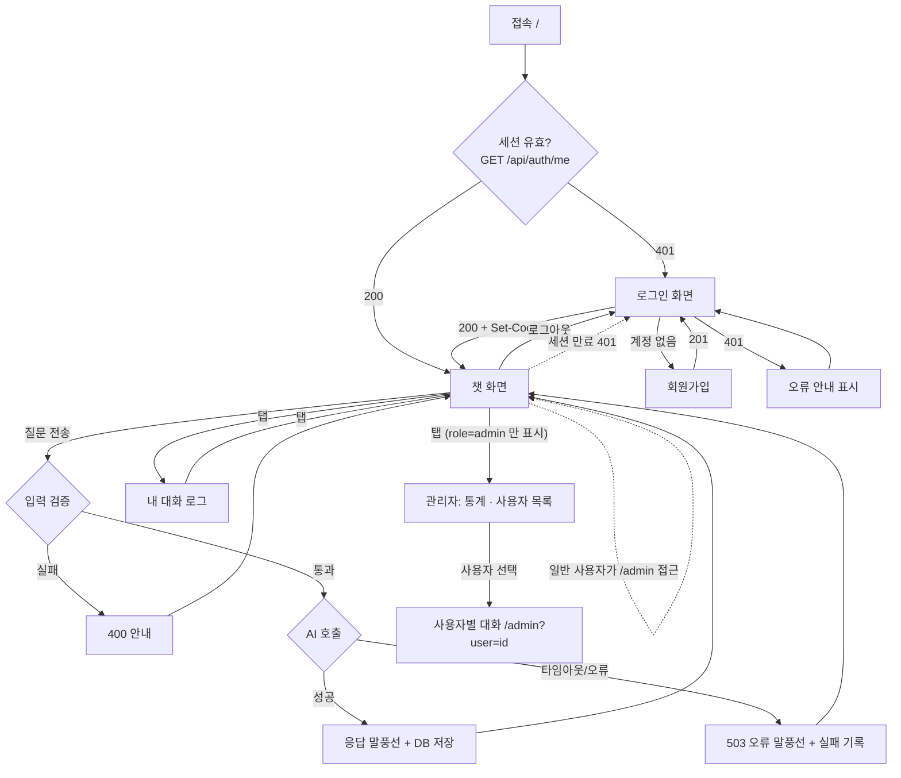

# 01. 서비스 시나리오

## 1. 문제 정의

기술 학습자(부트캠프·스터디 참여자)는 공부하다 막히면 검색과 질문을 반복한다. 일반 챗봇은
**대화 기록이 계정 단위로 남지 않고**, 장애가 나면 이유를 알 수 없으며, 무엇을 물어봤는지 **나중에 다시 추적하기 어렵다.**

**Chatlog** 는 로그인한 사용자의 질문에 AI 가 답하고, 모든 질문/응답을 사용자 기준으로 누적 저장해
언제든 다시 조회할 수 있게 하는 웹 챗봇 서비스다. AI 장애 시에도 서비스는 멈추지 않고 원인을 안내한다.

## 2. 타겟 사용자 (페르소나)

| 페르소나 | 상황 | 원하는 것 |
|----------|------|-----------|
| **학습자 (tester)** | 프로젝트 배포 중 막힘 | 이어서 묻는 질문에도 맥락을 기억하는 답변 |
| **팀원 / 평가자** | 기능 요구사항 검증 | 가입→로그인→질문→응답→기록 확인, 장애 재현 |
| **관리자 (admin)** | 특정 사용자의 대화 흐름·장애를 확인해야 함 | 브라우저 관리 페이지에서 **전체 사용자 목록 → 사용자별 대화 조회**, SQL 없이 추적 |
| **개발팀(운영 담당)** | AI API 가 느려짐 | 서버 로그(`logs/app.log`)·확인용 SQL 로 어느 구간에서 실패했는지 추적 |

> **관리자 기능 채택 근거**: mission §2-2 "관리자/내부 로그 확인 화면 제공"(47줄), §4-4 "관리자 조회 API/화면"(92줄)은
> "1개 이상 / 형태 자유" 선택지이며, 본 서비스는 **내 로그 API·화면, 확인용 SQL 과 함께 관리자 조회 API·화면도 제공**한다.
> 관리자는 `.env` 시드 계정으로만 존재하고(회원가입으로 생성 불가), 조회 전용이다.

## 3. 핵심 시나리오

### S1. 신규 사용자 첫 사용
1. `/` 접속 → 비로그인이므로 **로그인 화면**으로 이동
2. "회원가입" → 아이디/비밀번호 입력 → 가입 완료 안내와 함께 로그인 화면으로 이동(아이디 자동 입력)
3. 로그인 → **챗 화면** 진입, 환영 메시지 표시

### S2. 문맥이 이어지는 대화 (mission §7 예시)
1. "배포 방법 알려줘" 전송 → 로딩 표시 → 응답 말풍선
2. "내가 방금 뭘 물어봤지?" 전송 → 서버가 최근 5턴을 함께 보내므로 **직전 질문을 기억한 답변**
3. 우측 "서버 로그" 패널에 `request_received → ai_call_start → ai_call_success → db_save_success` 가 순서대로 표시

### S3. AI 장애 (타임아웃/오류)
1. 우측 "응답 시뮬레이션"에서 `AI_TIMEOUT (503)` 선택 후 "긴 글 요약해줘" 전송
2. `AI_TIMEOUT` 초(기본 15초) 후 **주황색 오류 말풍선**: "현재 응답이 지연되고 있어요… / 503 · AI_TIMEOUT"
3. 입력창은 즉시 다시 사용 가능, 서버 로그에 `ai_call_failed error=AI_TIMEOUT`, 이후 정상 질문도 계속 동작

### S4. 잘못된 입력
- 공백만 입력 → 전송 버튼 비활성 (클라이언트) / API 직접 호출 시 `400 INVALID_INPUT` (서버)
- 1000자 초과 → 입력 자체가 1000자에서 멈추고 카운터 `1000 / 1000` 강조

### S5. 내 대화 기록 추적
1. 상단 탭 "내 대화 로그" → 본인 기록만 카드 목록 (#id, user_id, 시각, QUESTION/ANSWER, 실패 시 오류 코드)
2. 총 기록 수 / 평균 응답시간 표시
3. 다른 계정으로 로그인하면 **서로의 기록이 보이지 않음**

### S6. 로그아웃 / 세션
1. "로그아웃" → 서버에서 세션 삭제 + 쿠키 제거 → 로그인 화면
2. 로그아웃 후 브라우저 뒤로가기로 `/chat` 접근 → 다시 로그인 화면
3. 새로고침해도 세션이 유효하면 로그인 상태 유지 (`GET /api/auth/me`)

### S7. 관리자의 사용자별 대화 추적
1. 관리자 계정(`ADMIN_USERNAME`) 로그인 → 헤더에 **"관리자"** 탭이 추가로 보임 (일반 사용자에게는 없음)
2. 상단 통계: 전체 사용자 / 대화 / 실패 / 평균 응답
3. 좌측 사용자 목록(최근 활동 순, 대화 수·실패 수·최근 활동) → 아이디 검색
4. 사용자 선택 → 우측에 그 사용자의 대화 카드(질문·응답·시각·오류 코드), `전체/성공/실패` 필터
5. URL 이 `/admin?user=<id>` 로 바뀌어 새로고침·링크 공유 시에도 같은 사용자 유지
6. 일반 사용자가 `/admin` 주소로 들어오면 챗 화면으로 이동, API 직접 호출은 `403 FORBIDDEN`
7. 관리자의 조회 행위는 서버 로그에 `admin_list_users` / `admin_view_chats target_user_id=` 로 남음 (감사 추적)

## 4. 유저 플로우

