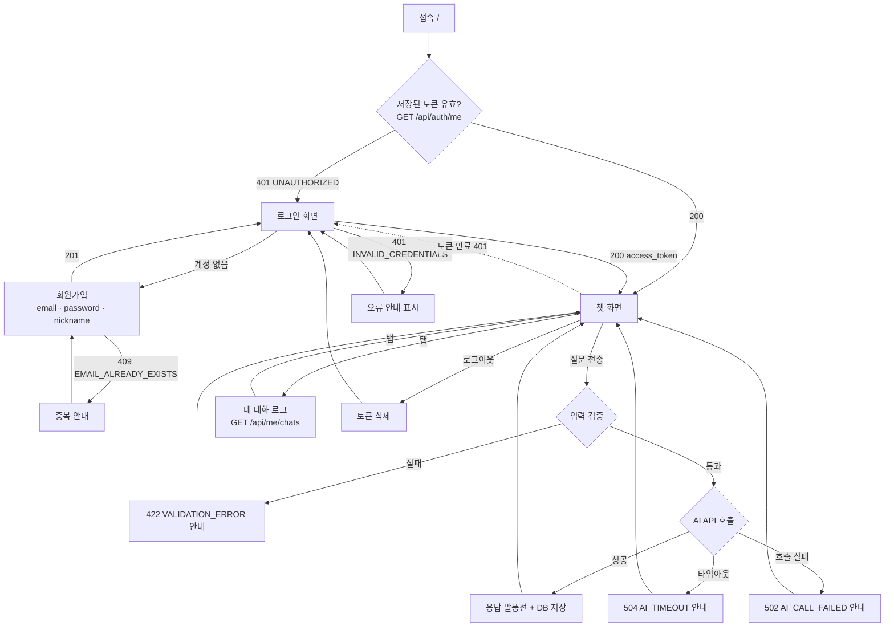

# 01. 서비스 시나리오

## 1. 문제 정의

기술 학습자(부트캠프·스터디 참여자)는 공부하다 막히면 검색과 질문을 반복한다. 일반 챗봇은
**대화 기록이 계정 단위로 남지 않고**, 장애가 나면 이유를 알 수 없으며, 무엇을 물어봤는지 **나중에 다시 추적하기 어렵다.**

**Chatlog** 는 로그인한 사용자의 질문에 AI 가 답하고, 모든 질문/응답을 사용자 기준으로 누적 저장해
언제든 다시 조회할 수 있게 하는 웹 챗봇 서비스다. AI 장애 시에도 서비스는 멈추지 않고 원인을 안내한다.

## 2. 타겟 사용자 (페르소나)

| 페르소나 | 상황 | 원하는 것 |
|----------|------|-----------|
| **학습자** | 프로젝트 배포 중 막힘 | 이어서 묻는 질문에도 맥락을 기억하는 답변 |
| **팀원 / 평가자** | 기능 요구사항 검증 | 가입→로그인→질문→응답→기록 확인, 장애 상황 확인 |
| **운영자** | AI API 가 느려지거나 쿼터를 초과 | 서버 로그로 어느 구간에서 실패했는지 추적 |

## 3. 핵심 시나리오

### S1. 신규 사용자 첫 사용
1. `/` 접속 → 비로그인이므로 **로그인 화면**으로 이동
2. "회원가입" → **이메일 / 비밀번호 / 닉네임** 입력 → `201` → 가입 완료 안내와 함께 로그인 화면으로 이동(이메일 자동 입력)
3. 로그인 → `access_token` 수신·저장 → **챗 화면** 진입, 헤더에 닉네임 표시

### S2. 문맥이 이어지는 대화
1. "배포 방법 알려줘" 전송 → 로딩 표시 → 응답 말풍선
2. "내가 방금 뭘 물어봤지?" 전송 → 서버가 최근 5턴을 함께 보내므로 **직전 질문을 기억한 답변**
3. 서버 로그에 `request_received → ai_call_start → ai_call_success → db_save_success` 가 순서대로 남음

### S3. AI 장애 (타임아웃 / 호출 실패)
1. AI API 응답이 `AI_TIMEOUT_SECONDS`(초안 30초)를 넘김
2. **504 `AI_TIMEOUT`** → 오류 말풍선: "현재 응답이 지연되고 있어요. 잠시 후 다시 시도해 주세요."
3. 쿼터 초과·키 오류·5xx 등은 **502 `AI_CALL_FAILED`** → "AI 응답을 가져오지 못했습니다."
4. **서버는 종료되지 않는다.** 입력창은 즉시 다시 사용 가능하고, 이어지는 정상 질문은 200 으로 처리된다.

### S4. 잘못된 입력
- 공백만 입력 → 전송 버튼 비활성 (클라이언트) / API 직접 호출 시 **422 `VALIDATION_ERROR`** (서버)
- 1000자 초과 → 입력이 1000자에서 멈추고 카운터 `1000 / 1000` 강조 / 서버는 422

### S5. 내 대화 기록 추적
1. 상단 탭 "내 대화 로그" → `GET /api/me/chats?limit=20&offset=0`
2. 본인 기록만 최신순 카드 목록 (`chat_id`, 시각, QUESTION / ANSWER), 상단에 `total`
3. 다른 계정으로 로그인하면 **서로의 기록이 보이지 않음**

### S6. 로그아웃 / 토큰 만료
1. "로그아웃" → 프론트가 **저장된 토큰 삭제** + 인증 상태 초기화 → 로그인 화면 (별도 API 없음)
2. 로그아웃 후 브라우저 뒤로가기로 `/chat` 접근 → 라우팅 가드가 다시 로그인 화면으로 보냄
3. 새로고침해도 토큰이 유효하면 `GET /api/auth/me` 로 **로그인 상태 복원**
4. 토큰 만료(60분) 후 요청 → **401 `UNAUTHORIZED`** → 자동으로 로그인 화면 이동

## 4. 유저 플로우

## 5. 시연 순서 (평가용)

[08-checklist.md](08-checklist.md) §4 평가 당일 체크리스트와 함께 사용한다.

| # | 동작 | 확인 포인트 |
|---|------|-------------|
| 1 | 배포 URL 을 **외부 네트워크(휴대폰 데이터망)** 에서 접속 | 접속 가능 |
| 2 | 회원가입 | 201, 중복 시 409 |
| 3 | 로그인 | 토큰 발급, 챗 화면 진입 |
| 4 | 질문 → 응답 | 같은 화면에 응답 표시 |
| 5 | 이어지는 질문 | 문맥 유지 확인 |
| 6 | 내 대화 로그 조회 | 저장된 기록 확인 (DB 확인 수단) |
| 7 | 로그아웃 후 `/chat` 재접근 | 차단됨 |
| 8 | AI 실패 상황 재현 | 오류 안내 표시 + 서버 유지 |
