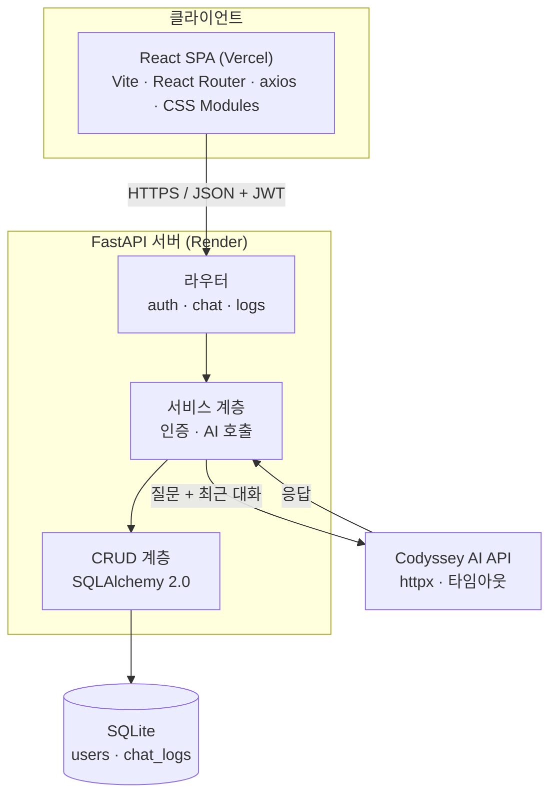
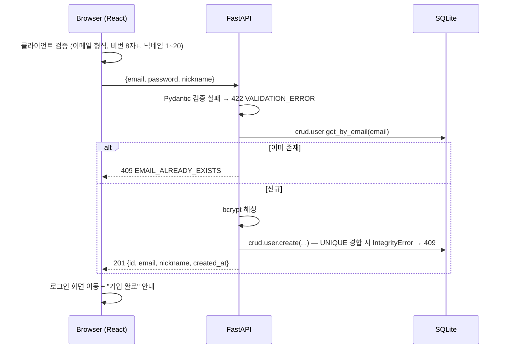
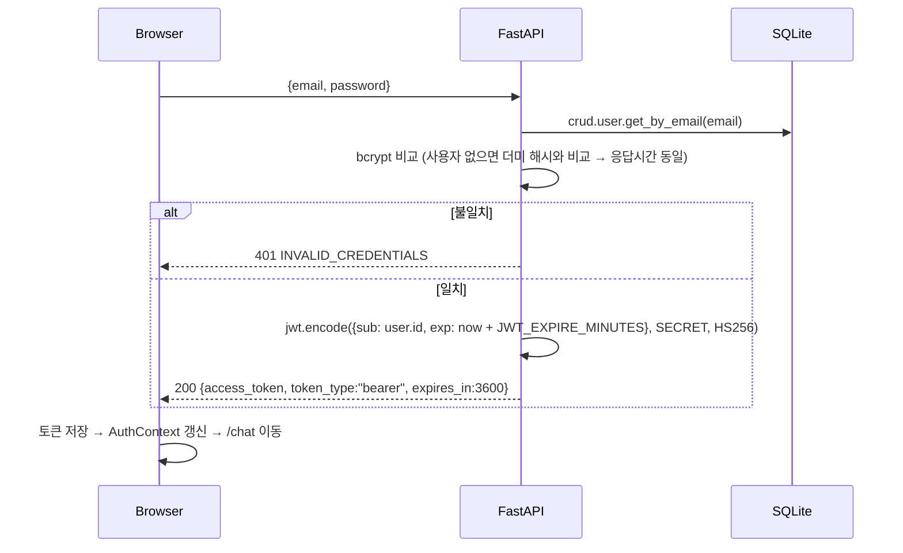
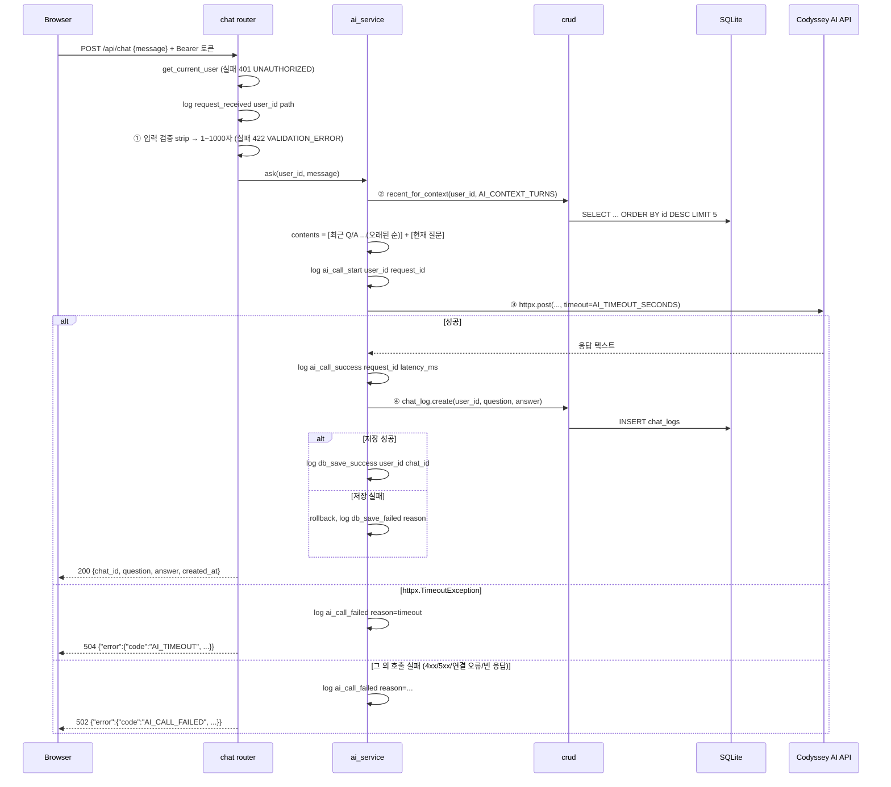

# 02. 시스템 구조 · 내부 절차 · 기술 결정

> 관련 문서: [03-api.md](03-api.md) · [04-database.md](04-database.md) · [features.md](features.md)
> 이 문서는 시스템 구조와 **내부 처리 절차·결정 근거**를 정리한다. 미확정·불일치 항목: [11-open-issues.md](11-open-issues.md)

## 1. 기술 스택

### 백엔드

| 구분 | 기술 | 용도 / 근거 |
|------|------|-------------|
| 언어 | **Python 3.11+** | mission §5 필수 |
| 프레임워크 | **FastAPI** | mission §5 필수. 웹 서버·라우팅 |
| ASGI 서버 | **Uvicorn** | 애플리케이션 실행 |
| ORM | **SQLAlchemy 2.0** | DB 접근 계층 분리 |
| DB | **SQLite** | 사용자 / 대화 로그 저장. 파일 1개라 평가자가 `sqlite3` 로 바로 확인 가능 |
| 스키마 검증 | **Pydantic v2** | 요청·응답 형식 관리 |
| 설정 관리 | **pydantic-settings**, python-dotenv | 환경변수 로딩 (mission §6) |
| 비밀번호 해싱 | **bcrypt** | 단방향·salt 내장. 평문 저장 금지 |
| 인증 | **PyJWT** | 토큰 발급·검증 |
| HTTP 클라이언트 | **httpx** | AI API 호출, 타임아웃 제어 |
| 로깅 | 표준 `logging` | 운영 이벤트 추적 (mission §4-5) |

### 프론트엔드

| 구분 | 기술 |
|------|------|
| 라이브러리 | **React** |
| 빌드 도구 | **Vite** |
| 라우팅 | **React Router** |
| HTTP | **axios** |
| 상태 관리 | **Context API** |
| 스타일 | **CSS Modules** (`*.module.css`, Vite 기본 지원) + 전역 CSS 변수 |

### 외부 서비스

| 구분 | 선택 | 비고 |
|------|------|------|
| AI API | **Codyssey AI API (COPA)** | 교육 환경 제공 API. OpenAI 호환 `chat/completions` 형식 |
| 백엔드 배포 | **Render** | 무료 웹 서비스, **15분 유휴 시 슬립** |
| 프론트 배포 | **Vercel** | 정적 빌드, 슬립 없음 |
| 형상관리 | **GitHub** | PR 기반 협업 |

## 2. 아키텍처



프론트(Vercel)와 백엔드(Render)는 **서로 다른 도메인**이다. 따라서
- 백엔드에 **CORS 설정이 필수**다 (`CORS_ORIGINS` 에 개발 서버 + Vercel 도메인).
- 쿠키 대신 **Authorization 헤더 기반 JWT** 를 쓴다 (§4).

## 3. 디렉터리 구조

```
.
├── backend/
│   ├── app/
│   │   ├── main.py              # FastAPI 앱, CORS, 라우터 등록, 예외 핸들러
│   │   ├── config.py            # 환경변수 로딩 (pydantic-settings)
│   │   ├── database.py          # 엔진·세션·Base·get_db
│   │   ├── models/              # SQLAlchemy 모델 (user.py, chat_log.py)
│   │   ├── schemas/             # Pydantic 스키마 (auth.py, chat.py, common.py)
│   │   ├── routers/             # auth.py, chat.py, logs.py
│   │   ├── services/            # auth_service.py, ai_service.py
│   │   ├── crud/                # user.py, chat_log.py
│   │   └── core/                # security.py, dependencies.py, logging.py
│   ├── scripts/check_logs.sql
│   ├── requirements.txt
│   └── .env.example
├── frontend/
│   └── src/
│       ├── api/                 # axios 인스턴스, 인터셉터
│       ├── contexts/            # AuthContext
│       ├── pages/               # Login, Signup, Chat, Logs
│       └── components/
├── .gitignore
└── README.md
```

### 컴포넌트 역할

| 계층 | 역할 |
|------|------|
| **React SPA** | 화면 렌더링, 토큰 보관, 입력 1차 검증, 라우팅 가드 |
| **라우터** | HTTP 엔드포인트 정의, 인증 dependency 적용, 요청·응답 스키마 바인딩. **DB 를 직접 건드리지 않음** |
| **서비스 계층** | 비즈니스 로직 — 비밀번호 해싱·검증, JWT 발급, 컨텍스트 구성, AI 호출과 예외 처리 |
| **CRUD 계층** | DB 질의 전담 |
| **SQLite** | 사용자 계정 및 대화 로그 영속 저장 |
| **Codyssey AI API** | 외부 AI 응답 생성. **키는 서버 환경변수에만 존재** |

| 파일 | 역할 |
|------|------|
| `app/main.py` | 앱 생성, CORS 미들웨어, 라우터 등록, 공통 에러 핸들러(`{"error":{"code","message"}}`) |
| `app/config.py` | `.env` → `Settings`. 비밀값은 코드에 기본값을 두지 않음 |
| `app/database.py` | 엔진/세션 팩토리, `PRAGMA foreign_keys=ON`, `get_db` 의존성 |
| `app/models/` | `User`, `ChatLog` |
| `app/schemas/` | `SignupIn/UserOut/LoginIn/TokenOut/ChatIn/ChatOut/ChatLogList/ErrorOut` |
| `app/core/security.py` | bcrypt 해시·검증, JWT 인코드·디코드 |
| `app/core/dependencies.py` | `get_current_user` — Bearer 토큰 → 사용자. 실패 시 401 |
| `app/core/logging.py` | 구조화 로그 포맷, `request_id` |
| `app/services/auth_service.py` | 가입/로그인 로직, 중복 검사, 토큰 발급 |
| `app/services/ai_service.py` | 컨텍스트 구성, httpx Codyssey AI API 호출, 타임아웃·예외 → `AI_TIMEOUT`/`AI_CALL_FAILED` |
| `app/routers/auth.py` | signup / login / me |
| `app/routers/chat.py` | `POST /api/chat` |
| `app/routers/logs.py` | `GET /api/me/chats` |
| `frontend/src/api/` | axios 인스턴스 + 인터셉터 (Authorization 자동 첨부, `error.code` 파싱, 401 처리) |
| `frontend/src/contexts/AuthContext` | 인증 상태 전역 관리, 앱 로드 시 `/api/auth/me` |
| `frontend/src/pages/` | Login · Signup · Chat · Logs |

## 4. 인증 방식 결정: JWT vs 서버 측 세션

### 결론: **JWT Bearer 토큰 (PyJWT, HS256)**

### 비교

| 기준 | JWT + Authorization 헤더 (**채택**) | 서버 측 세션 + 쿠키 |
|------|-----------------------------------|--------------------|
| **크로스 도메인** | 헤더 방식이라 도메인이 달라도 문제 없음 | `SameSite=None; Secure` + `credentials` 설정 필요, 브라우저 정책에 취약 |
| **무상태** | 서버가 세션 저장소 불필요 | 요청마다 세션 조회 |
| **인스턴스 재시작/슬립** | 영향 없음 | Render 슬립·재배포로 파일 DB 가 초기화되면 **전원 로그아웃** |
| **CSRF** | 쿠키 자동 첨부가 없어 CSRF 자체가 성립하지 않음 | 대응 필요(SameSite·Origin 검사) |
| **즉시 무효화** | 만료 전까지 유효 (약점) | DB 행 삭제로 즉시 무효 |
| **XSS 시 탈취** | localStorage 저장 시 노출 (약점) | HttpOnly 로 JS 접근 차단 |
| **구현 복잡도** | 낮음. `PyJWT` 인코드/디코드 + dependency 1개 | 세션 테이블·만료 청소·쿠키 속성 관리 |

### 이 프로젝트에서 JWT 를 택한 이유

1. **프론트와 백엔드가 서로 다른 도메인에 배포된다** (Vercel ↔ Render). 쿠키 인증은 크로스 사이트 쿠키가 되어 `SameSite=None; Secure` 와 CORS `credentials` 를 모두 맞춰야 하고, 브라우저의 서드파티 쿠키 차단 정책에 영향을 받는다. 헤더 방식은 이 문제가 없다.
2. **Render 무료 플랜은 15분 유휴 시 슬립**하고 파일시스템이 영속되지 않는다. 세션을 SQLite 에 저장하면 슬립 복구/재배포마다 로그인이 전부 풀릴 수 있다. JWT 는 서버 상태에 의존하지 않는다.
3. 구현 범위가 작다. 팀 3인이 병렬로 작업하는 상황에서 **인증 dependency 하나**로 챗·로그 라우터가 재사용할 수 있다 ([features.md](features.md) B6 — `get_current_user` 의존성).
4. CSRF 대응이 불필요해 백엔드 보안 작업량이 줄어든다.

### 채택에 따른 약점과 보완

| 위협 | 보완 |
|------|------|
| 로그아웃 후에도 토큰이 만료 전까지 유효 | 만료를 짧게(`JWT_EXPIRE_MINUTES=60`), 로그아웃 시 프론트가 토큰을 즉시 삭제 |
| XSS 로 localStorage 토큰 탈취 | React 기본 이스케이프 유지(`dangerouslySetInnerHTML` 미사용), 외부 스크립트 미삽입. **저장 위치(localStorage vs 메모리)는 프론트 담당이 최종 결정** ([03-api.md](03-api.md) §6) |
| `JWT_SECRET_KEY` 유출 시 전체 토큰 위조 | 키는 `.env` 로만 주입, 저장소 커밋 금지, Render 환경변수로 설정 |
| 알고리즘 혼동 공격(`alg:none` 등) | 디코드 시 `algorithms=["HS256"]` 을 **명시적으로 고정** |
| 네트워크 도청 | Render·Vercel 모두 HTTPS 기본 제공 |
| 계정 존재 추측 | 로그인 실패 메시지를 `INVALID_CREDENTIALS` 하나로 통일 |

## 5. 내부 처리 절차

### 5-1. 회원가입 `POST /api/auth/signup`



### 5-2. 로그인 `POST /api/auth/login`



### 5-3. 인증 확인 `get_current_user` (보호 API 공통)

1. `Authorization` 헤더 없음 / `Bearer ` 형식 아님 → **401 UNAUTHORIZED**
2. `jwt.decode(token, SECRET, algorithms=["HS256"])` 실패(만료·서명 오류) → **401 UNAUTHORIZED**
3. payload `sub` 로 사용자 조회, 없으면 **401 UNAUTHORIZED**
4. 사용자 반환 → 라우터는 `user.id` 만 사용. **클라이언트가 보낸 user_id 는 절대 사용하지 않는다.**

프론트: axios 응답 인터셉터가 401 을 감지 → 토큰 삭제 → AuthContext `user=null` → 라우팅 가드가 `/login` 으로 이동.

### 5-4. 챗 파이프라인 `POST /api/chat` (핵심)



**설계 포인트**

| 항목 | 결정 | 이유 |
|------|------|------|
| 검증 위치 | AI 호출 **이전** | 빈 입력으로 외부 API 호출·쿼터 소모 방지 |
| 서버 검증 | 프론트 검증과 **별개로 필수** | API 를 직접 호출하면 프론트 검증을 우회할 수 있음 ([features.md](features.md) B11) |
| 컨텍스트 | 같은 사용자 최근 `AI_CONTEXT_TURNS`(5) Q/A | 토큰 비용 상한 고정 |
| 컨텍스트 초과 | **오래된 것부터 잘라냄** | 최근 맥락 우선 유지 |
| 타임아웃 | `httpx.Timeout(AI_TIMEOUT_SECONDS)` | 무한 대기로 워커가 묶이는 것 방지 |
| 예외 변환 | `TimeoutException`→`AI_TIMEOUT`(504), 나머지→`AI_CALL_FAILED`(502) | 사용자에게는 두 코드만 노출, 상세 원인은 로그 `reason=` 으로 |
| 서버 유지 | 예외를 라우터에서 잡아 에러 응답으로 변환 | **AI 실패로 서버가 종료되면 안 됨** (mission §4-5) |
| 비동기 | `httpx.AsyncClient` + `await` | 대기 중 다른 요청 처리 |
| 로그 내용 | 질문 **원문 미기록**, 길이/식별자만 | 로그 파일 개인정보 노출 방지 |

### 5-5. 로그 조회 `GET /api/me/chats`

- `WHERE user_id = 토큰의 사용자` 를 강제 → 타 사용자 기록 조회 불가
- `total` + `items`(최신순, `limit`/`offset`)
- `limit` 은 최대 100 으로 상한 (과도한 조회 방지)

## 6. Codyssey AI API 연동 메모

| 항목 | 내용 |
|------|------|
| 엔드포인트 | `POST https://copa.codyssey.kr/v1/chat/completions` (OpenAI 호환 형식, 현재 `backend/main.py`) |
| 호출 방식 | REST 직접 호출. HTTP 클라이언트(httpx vs 현재 코드의 requests)는 [11-open-issues.md](11-open-issues.md) 참고 |
| 모델 | `gpt-5-mini` (현재 `backend/main.py` 값) |
| 키 전달 | `Authorization: Bearer <COPA_API_KEY>`. **서버에서만 사용**, 응답·프론트 번들에 절대 포함하지 않음 |
| 컨텍스트 형식 | `messages: [{role:"user"|"assistant", content}]` — 이전 Q/A 를 user/assistant 쌍으로 나열한 뒤 현재 질문 |
| 실패 유형 | 타임아웃 / 401·403(키 오류) / 429(호출 제한) / 5xx / 연결 실패 / 빈 응답 |
| 호출 제한 | 교육 환경의 제한값 미확인. 429 는 `AI_CALL_FAILED` 로 처리하고 로그 `reason=rate_limited` 로 구분 |

## 7. 요청 흐름 요약

1. 사용자가 React 화면에서 질문 입력
2. axios 가 `POST /api/chat` 호출 (`Authorization: Bearer <token>`)
3. FastAPI 라우터가 인증 dependency 로 사용자 확인
4. 서비스 계층이 CRUD 를 통해 해당 사용자의 최근 N개 대화 조회
5. httpx 로 Codyssey AI API 호출 (타임아웃 설정)
6. 응답 수신 → CRUD 계층이 `chat_logs` 에 질문·응답 저장
7. 결과를 JSON 으로 반환, React 가 화면에 렌더링
