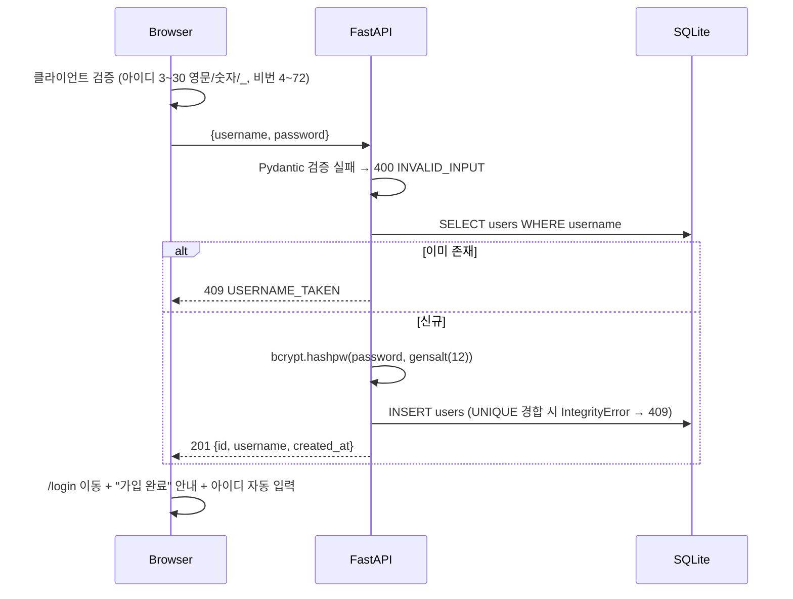
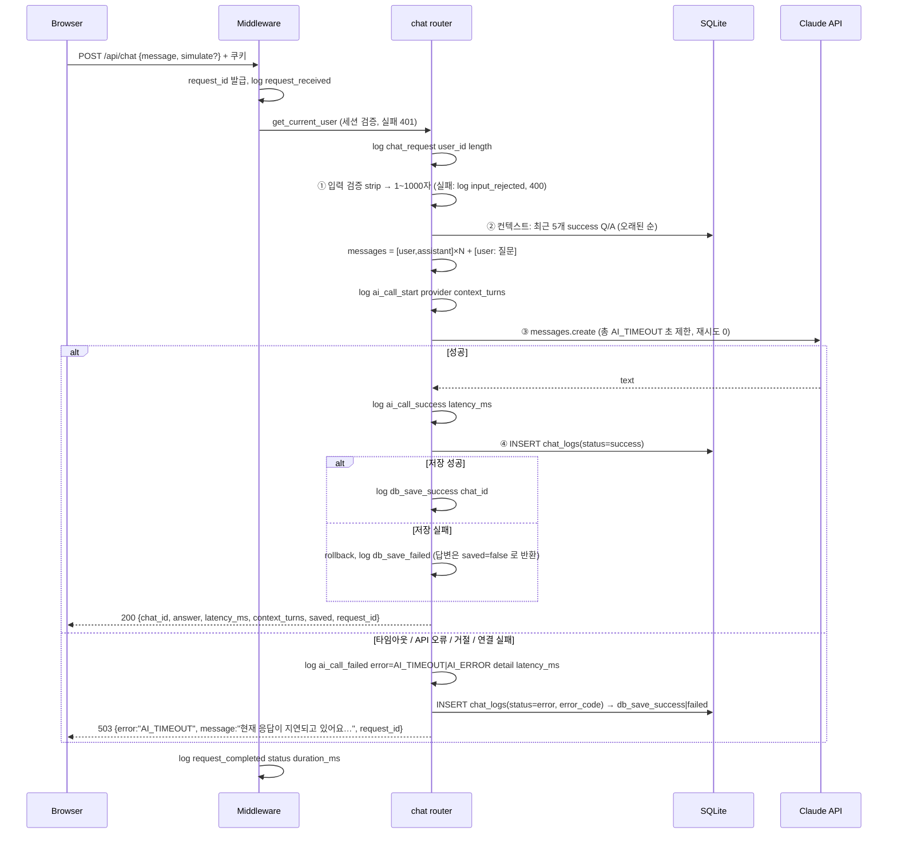
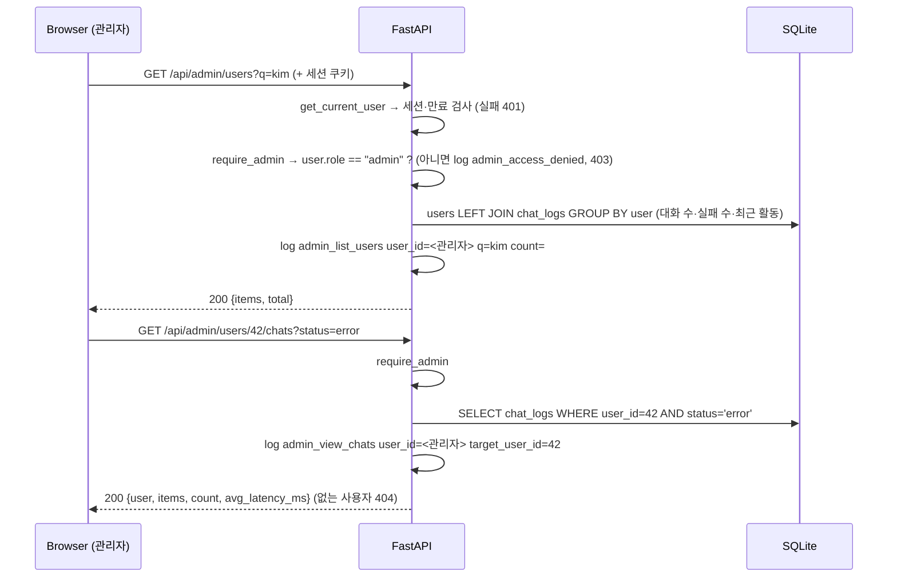

# 02. 시스템 구조 · 내부 절차 · 기술 결정

## 1. 기술 스택

| 영역 | 선택 | 근거 |
|------|------|------|
| 백엔드 | **Python 3.11+ / FastAPI** | mission §5 필수 |
| DB | **SQLite** + SQLAlchemy 2.0 ORM | mission §5 권장. 파일 1개라 평가자가 `sqlite3` 로 바로 확인 가능 |
| 프론트 | **React 19 + Vite + React Router** | 팀 결정. mission §3 "프론트 연동" 허용 |
| 인증 | **서버 측 세션 + HttpOnly 쿠키** | 아래 §4 |
| 비밀번호 | **bcrypt** (cost 12) | 단방향·salt 내장·의도적 지연 |
| AI | **Anthropic Claude API** (`anthropic` Python SDK, `claude-opus-5`) + `mock` 공급자 | 키 없이도 시연/테스트 가능 |
| 설정 | pydantic-settings + `.env` | mission §6 민감정보 환경변수 관리 |
| 로그 | Python `logging` → 콘솔 + `logs/app.log`(회전) + 메모리 링버퍼 | mission §4-5 이벤트 로그 |
| 테스트 | pytest + FastAPI TestClient, bash+curl E2E | 요구사항별 자동 검증 |
| 배포 | Ubuntu VM + **Nginx**(정적+리버스 프록시) + **systemd**(uvicorn) + certbot(HTTPS) | 단일 도메인 → 쿠키/CORS 단순 |

## 2. 아키텍처

```mermaid
flowchart LR
    subgraph Browser
      R[React SPA<br/>Login · Chat · Logs · Admin]
    end
    subgraph Server["Ubuntu VM"]
      N[Nginx :443]
      subgraph U["uvicorn :8000 (FastAPI)"]
        MW[request_context 미들웨어<br/>request_id · Origin 검사 · 요청 로그]
        AU[auth router]
        CH[chat router]
        ME[me router]
        AD[admin router<br/>통계·사용자·대화 조회]
        SY[system router]
        DEP[get_current_user<br/>세션 검증]
        ADM[require_admin<br/>role 검사]
        AI[ai_client<br/>timeout · 예외 변환]
        LG[logging_config]
      end
      DB[(SQLite app.db<br/>users(role) · sessions · chat_logs)]
      F[logs/app.log]
    end
    C[Claude API]

    R -- "HTTPS / (정적)" --> N
    R -- "HTTPS /api/* + 쿠키" --> N -- proxy --> MW
    MW --> AU & CH & ME & AD & SY
    CH & ME --> DEP --> DB
    AD --> ADM --> DEP
    AD --> DB
    AU --> DB
    CH --> AI -- "API 키(서버 전용)" --> C
    CH --> DB
    MW & AU & CH --> LG --> F
```

개발 환경에서는 Nginx 대신 **Vite dev server 의 `/api` 프록시**가 같은 역할을 한다 (브라우저 기준 동일 출처).

### 주요 컴포넌트 역할

| 파일 | 역할 |
|------|------|
| `backend/app/main.py` | 앱 생성, lifespan(로깅·DB 생성·데모 계정 시드), 미들웨어(request_id, Origin 검사, 요청 로그), 라우터 등록 |
| `backend/app/config.py` | `.env` → `Settings`. 비밀값은 기본값 없음 |
| `backend/app/database.py` | 엔진/세션 팩토리, SQLite FK 활성화, `get_db` 의존성 |
| `backend/app/models.py` | `User`, `AuthSession`, `ChatLog` |
| `backend/app/security.py` | bcrypt 해시/검증, 세션 토큰 생성·SHA-256 해시 |
| `backend/app/deps.py` | `get_current_user` — 쿠키→세션→사용자, 없거나 만료면 401 |
| `backend/app/ai_client.py` | Claude/mock 공급자, 총 소요시간 타임아웃, SDK 예외 → `AI_TIMEOUT`/`AI_ERROR` |
| `backend/app/routers/auth.py` | 회원가입/로그인/로그아웃/me |
| `backend/app/routers/chat.py` | 챗 파이프라인(검증→컨텍스트→AI→저장) |
| `backend/app/routers/me.py` | 내 대화 로그, 내 서버 로그 |
| `backend/app/routers/admin.py` | 관리자 조회: 통계, 사용자 목록(집계·검색), 사용자별 대화. 전부 `require_admin`, 감사 로그 |
| `backend/app/deps.py` `require_admin` | `get_current_user` 위에서 `role == "admin"` 검사, 아니면 403 |
| `backend/app/routers/system.py` | health, 공개 설정 |
| `backend/app/errors.py` | 오류 응답 통일 `{error, message, request_id}` |
| `backend/app/logging_config.py` | 구조화 로그, 파일 회전, 사용자별 링버퍼 |
| `frontend/src/api.js` | fetch 래퍼. 오류를 `ApiError(status, code, message)` 로 통일, 401 전역 이벤트 |
| `frontend/src/auth.jsx` | 인증 상태 Context (앱 로드시 `/auth/me`), login/signup/logout |
| `frontend/src/App.jsx` | 라우팅 + `RequireAuth` / `GuestOnly` 가드 |
| `frontend/src/pages/*` | 로그인·회원가입 / 챗 / 내 대화 로그 / 관리자 화면 |
| `frontend/src/components/LogCard.jsx` | 대화 로그 카드 (내 대화 로그·관리자 화면 공용) |
| `frontend/src/App.jsx` `RequireAdmin` | `/admin` 가드: 비로그인 → `/login`, 일반 사용자 → `/chat` (UI 편의용, 최종 권한은 서버) |

## 3. 내부 처리 절차

### 3-1. 모든 요청 공통 (미들웨어)

1. `request_id` = uuid 12자리 발급 → `contextvars` 에 저장 → 이후 모든 로그 줄 끝에 `request_id=` 자동 부착
2. `request_received method= path=` 로그
3. POST 요청에 `Origin` 헤더가 있고 같은 호스트/허용 목록이 아니면 **403 FORBIDDEN_ORIGIN** (CSRF 2차 방어)
4. 라우터 실행 → 응답 헤더 `X-Request-ID` 부착 → `request_completed status= duration_ms=` 로그

### 3-2. 회원가입 `POST /api/auth/signup`



### 3-3. 로그인 `POST /api/auth/login`

```mermaid
sequenceDiagram
    participant B as Browser
    participant A as FastAPI
    participant D as SQLite
    B->>A: {username, password}
    A->>D: SELECT user
    A->>A: bcrypt 비교 (사용자 없으면 더미 해시와 비교 → 응답시간 동일)
    alt 불일치
        A-->>B: 401 INVALID_CREDENTIALS (아이디/비번 중 무엇이 틀렸는지 알리지 않음)
    else 일치
        A->>D: 기존 쿠키 세션 삭제 (세션 고정 방지)
        A->>A: token = secrets.token_urlsafe(32)
        A->>D: INSERT sessions(token_hash=SHA256(token), user_id, expires_at=+24h)
        A-->>B: 200 user + Set-Cookie chatlog_session=token; HttpOnly; SameSite=Lax; (Secure)
    end
```

### 3-4. 인증 확인 `get_current_user` (보호 API 공통)

1. 쿠키 `chatlog_session` 없음 → **401 UNAUTHORIZED**
2. `SHA256(token)` 으로 `sessions` 조회 → 없음 → 401
3. `expires_at` 경과 → 세션 삭제 후 **401 SESSION_EXPIRED**
4. 사용자 반환 → 라우터에서 `user.id` 사용 (클라이언트가 보낸 user_id 는 절대 사용하지 않음)

프론트: 어떤 API 든 401 → `auth:unauthorized` 이벤트 → Context 의 user=null → `RequireAuth` 가 `/login` 으로 리다이렉트.

### 3-5. 챗 파이프라인 `POST /api/chat` (핵심)



**설계 포인트**

| 항목 | 결정 | 이유 |
|------|------|------|
| 검증 위치 | AI 호출 **이전** | 빈 입력으로 유료 API 호출 방지 |
| 컨텍스트 | 같은 사용자 최근 `CONTEXT_TURNS`(5) 개의 **성공** Q/A | 토큰 비용 상한 고정, 실패 기록은 답변이 없어 제외 |
| 타임아웃 | SDK `timeout` + `asyncio.wait_for(총 AI_TIMEOUT)` 이중 | SDK 타임아웃은 구간(read 등) 단위라 총 소요시간 보장을 위해 한 번 더 |
| 재시도 | `max_retries=0` | 재시도 누적으로 사용자 대기시간이 타임아웃을 넘지 않게 |
| 예외 변환 | `APITimeoutError`→AI_TIMEOUT, 인증/429/5xx/연결/거절/빈응답 → AI_ERROR | 사용자에게는 두 코드만, 상세 원인은 로그 `detail=` 로 |
| 실패 기록 | chat_logs 에 `status=error` 저장 | 사용자 기준 장애 추적 가능 |
| 저장 실패 | 답변은 반환(`saved:false`) + `db_save_failed` 로그 | 이미 비용을 쓴 답변을 버리지 않음 |
| 비동기 | AI 호출은 `await` (이벤트 루프 비차단) | 대기 중에도 다른 요청 처리 |
| 로그 내용 | 질문 **길이만** 기록, 원문·비밀번호 미기록 | 로그 파일 개인정보 노출 방지 |

### 3-6. 로그 조회

- `GET /api/me/chats` : `WHERE user_id = 세션 사용자` 강제, 최신순, 총 개수·평균 응답시간(성공 기준)
- `GET /api/me/server-logs` : 링버퍼에서 **본인 요청(request_id→user_id 매핑)** 에서 발생한 로그만 반환 → 챗 화면 "서버 로그" 패널
- `backend/scripts/check_logs.sql` : 평가자용 SQL (사용자별 집계, 최근 20건, 특정 사용자 추적, 해시 확인)

### 3-7. 관리자 조회 (역할 기반 접근 제어)

**역할 부여**
- `users.role` = `user`(기본) | `admin`
- 회원가입 API 는 role 을 받지 않는다 (`Credentials` 스키마에 필드 없음 → 요청에 넣어도 무시, 검증 V87)
- 관리자는 서버 시작 시 `.env` 의 `ADMIN_USERNAME`/`ADMIN_PASSWORD` 로 **생성 또는 기존 계정 승격** (`seed_admin_user`)
- 이전 버전 DB 는 시작 시 `migrate_schema()` 가 `role` 컬럼을 추가 (기존 사용자는 `user`)



| 설계 포인트 | 결정 | 이유 |
|-------------|------|------|
| 권한 검사 위치 | **서버 의존성** `require_admin` | 프론트 가드(`RequireAdmin`)는 화면 편의일 뿐, API 직접 호출도 막아야 함 |
| role 조회 시점 | 요청마다 DB 에서 읽음 | 강등 즉시 기존 세션도 403 (JWT 에 role 을 넣으면 만료 전까지 유지됨) — 검증 V91 |
| 관리자 생성 | `.env` 시드만 | 가입·API 로 권한 상승 경로 제거 |
| 기능 범위 | **조회 전용** (수정·삭제 없음) | mission 요구는 확인/추적. 실수·오남용 위험 최소화 |
| 감사 로그 | 누가(user_id) 누구를(target_user_id) 봤는지 기록 | 타인 대화 열람은 민감 행위 → 추적 가능해야 함 |
| 비밀번호 해시 | 관리자 응답에도 미포함 | 응답 스키마에 필드 자체가 없음 |
| 집계 | 한 번의 `LEFT JOIN ... GROUP BY` | 사용자 수만큼 쿼리하지 않음 (N+1 방지) |

### 3-8. 응답 시뮬레이션 (DEMO_MODE)

평가 시점에 실제 AI 장애를 만들 수 없으므로, `DEMO_MODE=true` 일 때만 `simulate` 필드를 허용한다.

- `timeout` : AI 호출 대신 `AI_TIMEOUT+5` 초 sleep → **실제 `asyncio.wait_for` 타임아웃 경로**를 그대로 통과
- `error` : 상위 API 오류와 동일한 `AIError("AI_ERROR")` 발생
- 운영에서는 `DEMO_MODE=false` → `simulate` 전송 시 400

실제 키 기반 장애 재현: `AI_TIMEOUT=0.01` 로 낮추거나 `ANTHROPIC_API_KEY` 를 잘못된 값으로 바꾸고 재시작.

## 4. 인증 방식 결정: 서버 측 세션 vs JWT

### 결론: **서버 측 세션 (DB 저장) + HttpOnly·SameSite 쿠키**

전통적인 웹 서비스(Django, Rails, Spring Session, Express-session 등)의 기본 방식이며,
OWASP Session Management Cheat Sheet 가 권장하는 형태다.

### 비교

| 기준 | 서버 측 세션 + HttpOnly 쿠키 (채택) | JWT (localStorage / Authorization 헤더) |
|------|-----------------------------------|----------------------------------------|
| **즉시 무효화** (로그아웃·탈취 대응·비번 변경) | DB 행 삭제로 **즉시** 무효 | 만료 전까지 유효. 막으려면 블랙리스트 저장소 필요 → 결국 상태 저장 |
| **XSS 시 토큰 탈취** | HttpOnly → JS 로 읽기 불가 | localStorage 저장 시 스크립트 한 줄로 탈취 |
| **서명 키 유출 영향** | 토큰은 난수, 위조할 서명 자체가 없음 | 키 유출 시 모든 사용자 토큰 위조 가능 |
| **알고리즘 취약점** | 해당 없음 | `alg:none`, 키 혼동 등 구현 실수 사례 다수 |
| **DB 유출 시** | 토큰 SHA-256 해시만 저장 → 원본 토큰 복원 불가 | (서버 저장 없음) |
| **CSRF** | 쿠키 자동 첨부 → 대응 필요 (아래 3중 방어) | 헤더 방식이면 CSRF 없음 |
| **확장성** | 요청마다 세션 조회 1회 (인덱스, 단일 서버 SQLite 에서 무시 가능) | 무상태 → 다중 서버·마이크로서비스에 유리 |
| **구현 복잡도** | 낮음 (쿠키는 브라우저가 관리) | Refresh 토큰 회전·저장 위치·만료 처리 필요 |

### 이 프로젝트에 맞는 이유 (논리)

1. **아키텍처가 단일 서버 모놀리스**다 (FastAPI 1개 + SQLite 파일 1개). JWT 의 유일한 큰 장점인 "여러 서버가 DB 조회 없이 검증"이 필요 없다.
2. **로그아웃이 즉시 효력**을 가져야 한다. mission 은 인증 상태에 따른 접근 제어를 요구하는데, JWT 는 로그아웃 후에도 토큰이 살아 있어 이를 완전히 보장하지 못한다. (검증 케이스 V14/E71: 로그아웃 후 이전 쿠키 재사용 → 401)
3. **AI API 비용이 드는 기능**을 보호한다. 탈취 시 서버에서 해당 세션만 즉시 끊을 수 있어야 한다.
4. React 가 토큰을 **직접 다루지 않는다**. 저장 위치 고민(localStorage vs 메모리)과 XSS 노출면이 사라진다.
5. 프론트와 API 를 **같은 도메인**(Nginx / Vite 프록시)으로 제공하므로 쿠키 방식의 단점(크로스 도메인)이 발생하지 않는다.

### 적용한 보안 조치

| 위협 | 조치 |
|------|------|
| XSS 로 세션 탈취 | `HttpOnly` 쿠키, React 기본 이스케이프(`dangerouslySetInnerHTML` 미사용) |
| 네트워크 도청 | 운영 `SESSION_COOKIE_SECURE=true` + HTTPS(certbot) |
| CSRF | ① `SameSite=Lax` ② 상태 변경 요청 `Origin` 검사(403) ③ API 는 JSON 본문만 허용(폼 전송으로 호출 불가) |
| 세션 고정 | 로그인 시 기존 세션 삭제 후 새 토큰 발급 |
| 토큰 추측 | `secrets.token_urlsafe(32)` = 256bit 난수 |
| DB 유출 | 비밀번호 bcrypt, 세션 토큰 SHA-256 해시만 저장 |
| 계정 존재 추측 | 로그인 실패 메시지 통일 + 없는 사용자도 bcrypt 비교(응답시간 동일) |
| 세션 장기 탈취 | 24시간 만료(`SESSION_TTL_HOURS`), 만료 세션 조회 시 삭제 |
| 권한 상승 | 가입 시 role 입력 불가, 관리자는 `.env` 시드만, 모든 관리자 API 서버 측 `require_admin` |
| 타인 대화 열람 오남용 | 관리자 조회 전용 + `admin_view_chats target_user_id=` 감사 로그 |
