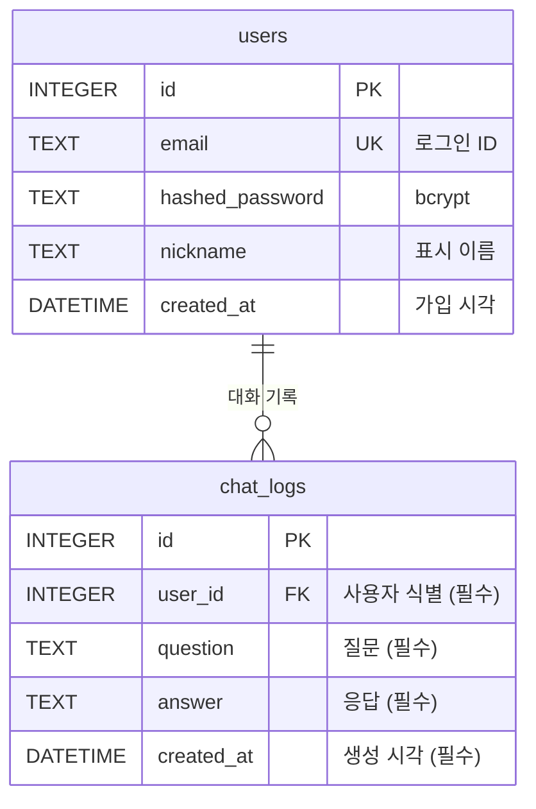

# 04. DB 구조

> 관련 문서: [03-api.md](03-api.md) §4 · [02-architecture.md](02-architecture.md)

- DB: **SQLite** (`DATABASE_URL=sqlite:///./data/app.db`)
- ORM: **SQLAlchemy 2.0** (`Mapped` / `mapped_column` 스타일)
- 테이블 생성: 앱 시작 시 `Base.metadata.create_all(bind=engine)`
- FK 제약: SQLite 는 기본 비활성이므로 연결 시 `PRAGMA foreign_keys=ON`

## ERD



세션 테이블은 없다. **JWT 는 서버에 상태를 저장하지 않기 때문**이다 (근거: [02-architecture.md](02-architecture.md) §4).

## 테이블 상세

### users

| 필드 | 타입 | 제약 | 설명 |
|------|------|------|------|
| `id` | INTEGER | PK, AUTOINCREMENT | 사용자 식별자. JWT payload `sub` 에 담긴다 |
| `email` | TEXT | UNIQUE, INDEX, NOT NULL | 로그인 ID. 이메일 형식 검증(Pydantic `EmailStr`) |
| `hashed_password` | TEXT | NOT NULL | bcrypt 해시(`$2b$...`, 60자). **평문 저장 금지** |
| `nickname` | TEXT | NOT NULL | 1~20자. 화면 표시용 |
| `created_at` | DATETIME | NOT NULL | 가입 시각 |

### chat_logs

| 필드 | 타입 | 제약 | 설명 |
|------|------|------|------|
| `id` | INTEGER | PK | 대화 식별자. API 응답에서는 `chat_id` 로 노출 |
| `user_id` | INTEGER | FK→users.id ON DELETE CASCADE, INDEX | **사용자 식별** — 조회 시 토큰의 사용자로만 필터 |
| `question` | TEXT | NOT NULL | **질문** (앞뒤 공백 제거 후 저장) |
| `answer` | TEXT | NOT NULL | **AI 응답** |
| `created_at` | DATETIME | NOT NULL, INDEX | **생성 시각** (최신순 정렬·페이지네이션용) |

> 평가지 최소 추적 필드(**사용자 식별 / 생성 시각 / 질문 / 응답**)를 모두 포함한다.

**컨텍스트 조회 쿼리** (`POST /api/chat` 3단계)
```sql
SELECT question, answer FROM chat_logs
WHERE user_id = :user_id
ORDER BY id DESC
LIMIT :context_turns;   -- AI_CONTEXT_TURNS (초안 5)
```
조회 후 **오래된 순으로 뒤집어** 프롬프트에 배치한다.

**로그 조회 쿼리** (`GET /api/me/chats`)
```sql
SELECT COUNT(*) FROM chat_logs WHERE user_id = :user_id;                -- total
SELECT * FROM chat_logs WHERE user_id = :user_id
ORDER BY id DESC LIMIT :limit OFFSET :offset;                           -- items
```

## 설계 기준 DDL

SQLAlchemy 모델이 생성해야 할 스키마다. 구현 후 `sqlite3 data/app.db ".schema"` 결과가 아래와 일치해야 한다.

```sql
CREATE TABLE users (
	id INTEGER NOT NULL,
	email TEXT NOT NULL,
	hashed_password TEXT NOT NULL,
	nickname TEXT NOT NULL,
	created_at DATETIME NOT NULL,
	PRIMARY KEY (id)
);
CREATE UNIQUE INDEX ix_users_email ON users (email);

CREATE TABLE chat_logs (
	id INTEGER NOT NULL,
	user_id INTEGER NOT NULL,
	question TEXT NOT NULL,
	answer TEXT NOT NULL,
	created_at DATETIME NOT NULL,
	PRIMARY KEY (id),
	FOREIGN KEY(user_id) REFERENCES users (id) ON DELETE CASCADE
);
CREATE INDEX ix_chat_logs_user_id ON chat_logs (user_id);
CREATE INDEX ix_chat_logs_created_at ON chat_logs (created_at);
```

## CRUD 계층 분리

라우터에는 DB 로직을 두지 않는다 ([02-architecture.md](02-architecture.md) §3 — CRUD 계층).

| 파일 | 함수 | 역할 |
|------|------|------|
| `app/crud/user.py` | `get_by_email(db, email)` | 로그인·중복 검사 |
| | `create(db, email, hashed_password, nickname)` | 회원가입 |
| | `get(db, user_id)` | 토큰 → 사용자 |
| `app/crud/chat_log.py` | `recent_for_context(db, user_id, n)` | 컨텍스트용 최근 N턴 |
| | `create(db, user_id, question, answer)` | 대화 저장 |
| | `list_for_user(db, user_id, limit, offset)` | 로그 조회 |
| | `count_for_user(db, user_id)` | `total` |

## DB 확인 방법 (평가 항목)

평가자가 아래 중 원하는 방법으로 확인할 수 있다.

1. **로그 조회 API**: `GET /api/me/chats` — [03-api.md](03-api.md) §3
2. **화면**: 로그인 → "내 대화 로그" 페이지 (`frontend/src/pages/Logs`)
3. **SQL 스크립트**: `sqlite3 backend/data/app.db < backend/scripts/check_logs.sql`

```sql
-- backend/scripts/check_logs.sql (요지)
.headers on
.mode column

-- 사용자별 대화 수
SELECT u.id, u.email, u.nickname, COUNT(c.id) AS total
FROM users u LEFT JOIN chat_logs c ON c.user_id = u.id
GROUP BY u.id ORDER BY total DESC;

-- 최근 대화 20건
SELECT c.id, u.email, c.created_at, c.question, c.answer
FROM chat_logs c JOIN users u ON u.id = c.user_id
ORDER BY c.id DESC LIMIT 20;

-- 특정 사용자 추적
SELECT c.id, c.created_at, c.question FROM chat_logs c
JOIN users u ON u.id = c.user_id
WHERE u.email = 'user@example.com' ORDER BY c.id DESC;

-- 비밀번호가 평문이 아닌지 확인 (bcrypt prefix, 길이 60)
SELECT email, substr(hashed_password, 1, 7) AS hash_prefix, length(hashed_password) AS len FROM users;
```

## 운영 주의: Render 디스크

Render 무료 웹 서비스는 **파일시스템이 영속되지 않는다**(재배포·슬립 복구 시 초기화될 수 있음).
평가 시점 데이터 유지가 필요하면 아래 중 하나를 택한다.

| 선택지 | 내용 |
|--------|------|
| 그대로 사용 | 평가 당일 시연 직전에 계정 생성 + 대화 몇 건을 만들어 둔다 (가장 단순, 초안 범위) |
| Render Persistent Disk | 유료 플랜 필요. `DATABASE_URL` 을 마운트 경로로 지정 |
| 외부 DB 로 전환 | 예: Neon/Supabase Postgres. SQLAlchemy 라 URL 만 교체하면 됨. **스택 변경이므로 팀 합의 필요** |

현재 합의: **그대로 사용** ([02-architecture.md](02-architecture.md) §1 의 SQLite 선택 유지).
