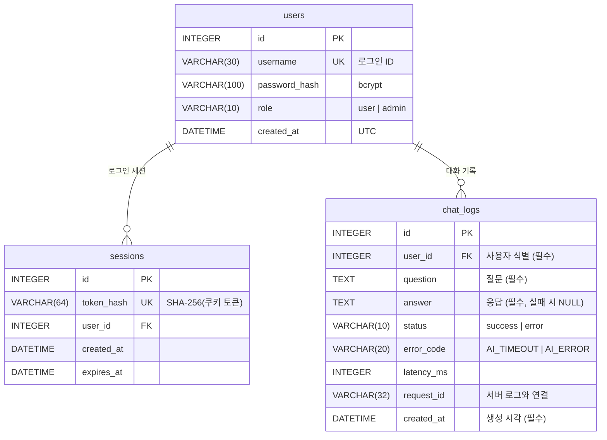

# 04. DB 구조

SQLite 파일: `backend/app.db` (앱 시작 시 `Base.metadata.create_all` 로 자동 생성, FK 제약 `PRAGMA foreign_keys=ON`)

## ERD



## 테이블 상세

### users
| 필드 | 타입 | 제약 | 설명 |
|------|------|------|------|
| id | INTEGER | PK | 사용자 식별자 |
| username | VARCHAR(30) | UNIQUE, INDEX, NOT NULL | 영문/숫자/_ 3~30자 |
| password_hash | VARCHAR(100) | NOT NULL | bcrypt (`$2b$12$...`, 60자). 평문 저장 안 함 |
| role | VARCHAR(10) | NOT NULL, DEFAULT `'user'` | `user` / `admin`. 가입은 항상 user, admin 은 `.env` 시드로만 |
| created_at | DATETIME | NOT NULL | 가입 시각 (UTC) |

> **마이그레이션**: `role` 은 뒤에 추가된 컬럼이다. `create_all` 은 기존 테이블을 바꾸지 않으므로,
> 앱 시작 시 `database.migrate_schema()` 가 `PRAGMA table_info(users)` 로 확인 후
> `ALTER TABLE users ADD COLUMN role VARCHAR(10) NOT NULL DEFAULT 'user'` 를 1회 실행한다 (기존 데이터 보존, 멱등 — 검증 V89).

### sessions
| 필드 | 타입 | 제약 | 설명 |
|------|------|------|------|
| id | INTEGER | PK | |
| token_hash | VARCHAR(64) | UNIQUE, INDEX | 쿠키 토큰의 SHA-256. 원본 토큰은 저장하지 않음 |
| user_id | INTEGER | FK→users.id ON DELETE CASCADE, INDEX | |
| created_at | DATETIME | | 발급 시각 |
| expires_at | DATETIME | | 만료 시각 (기본 +24h) |

### chat_logs
| 필드 | 타입 | 제약 | 설명 |
|------|------|------|------|
| id | INTEGER | PK | 대화 식별자 (`#id` 로 화면 표시) |
| user_id | INTEGER | FK→users.id, INDEX | **사용자 식별** — 조회 시 세션 사용자로만 필터 |
| question | TEXT | NOT NULL | **질문** (공백 제거 후 저장) |
| answer | TEXT | NULL | **응답**. AI 실패 시 NULL |
| status | VARCHAR(10) | NOT NULL | `success` / `error` — 컨텍스트에는 success 만 사용 |
| error_code | VARCHAR(20) | NULL | 실패 원인 코드 |
| latency_ms | INTEGER | NULL | AI 호출 소요시간 |
| request_id | VARCHAR(32) | NULL | `logs/app.log` 의 `request_id=` 와 동일 → DB↔로그 교차 추적 |
| created_at | DATETIME | INDEX | **생성 시각** (UTC) |

> mission §4-4 최소 추적 필드(사용자 식별·생성 시각·질문·응답)를 모두 포함하고, 장애 추적을 위해 status/error_code/latency_ms/request_id 를 추가했다.

## `.schema` 실제 출력

```sql
-- 기존 DB 에 마이그레이션이 적용된 모습 (신규 DB 는 role 이 created_at 앞에 위치)
CREATE TABLE users (
	id INTEGER NOT NULL,
	username VARCHAR(30) NOT NULL,
	password_hash VARCHAR(100) NOT NULL,
	created_at DATETIME NOT NULL, role VARCHAR(10) NOT NULL DEFAULT 'user',
	PRIMARY KEY (id)
);
CREATE UNIQUE INDEX ix_users_username ON users (username);
CREATE TABLE sessions (
	id INTEGER NOT NULL,
	token_hash VARCHAR(64) NOT NULL,
	user_id INTEGER NOT NULL,
	created_at DATETIME NOT NULL,
	expires_at DATETIME NOT NULL,
	PRIMARY KEY (id),
	FOREIGN KEY(user_id) REFERENCES users (id) ON DELETE CASCADE
);
CREATE INDEX ix_sessions_user_id ON sessions (user_id);
CREATE UNIQUE INDEX ix_sessions_token_hash ON sessions (token_hash);
CREATE TABLE chat_logs (
	id INTEGER NOT NULL,
	user_id INTEGER NOT NULL,
	question TEXT NOT NULL,
	answer TEXT,
	status VARCHAR(10) NOT NULL,
	error_code VARCHAR(20),
	latency_ms INTEGER,
	request_id VARCHAR(32),
	created_at DATETIME NOT NULL,
	PRIMARY KEY (id),
	FOREIGN KEY(user_id) REFERENCES users (id) ON DELETE CASCADE
);
CREATE INDEX ix_chat_logs_created_at ON chat_logs (created_at);
CREATE INDEX ix_chat_logs_user_id ON chat_logs (user_id);
```

## DB 확인 가이드 (mission §2-2)

평가자가 다음 방법 중 원하는 것으로 확인할 수 있다.

1. **로그 조회 API**: `GET /api/me/chats` (본인) · `GET /api/admin/users`, `GET /api/admin/users/{id}/chats` (관리자, docs/03-api.md)
2. **화면**: "내 대화 로그" 탭(본인) · **"관리자" 탭(관리자 계정 — 전체 사용자 목록 → 사용자별 대화)**
3. **SQL 스크립트**:
   ```bash
   sqlite3 backend/app.db < backend/scripts/check_logs.sql
   ```
   - 사용자별 총/성공/실패/평균 응답시간
   - 최근 대화 20건 (username, created_at, status, question, answer)
   - 특정 사용자 추적 (`WHERE u.username = 'tester'`)
   - 비밀번호 해시 prefix 확인 (`$2b$12`)

DB ↔ 서버 로그 교차 추적:
```bash
sqlite3 backend/app.db "select request_id from chat_logs where status='error' order by id desc limit 1;"
grep <request_id> backend/logs/app.log
```
