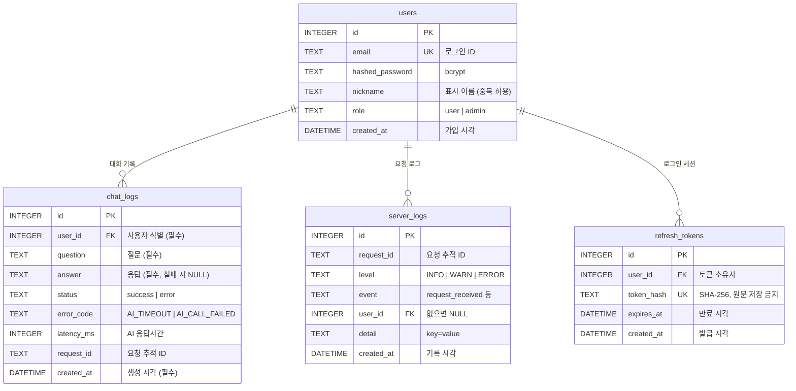

# 04. DB 구조

> 관련 문서: [03-api.md](03-api.md) §5 · [02-architecture.md](02-architecture.md)

- DB: **SQLite** (로컬 `DATABASE_URL=sqlite:///./data/app.db`, Railway `sqlite:////data/app.db` — Volume 마운트 경로)
- ORM: **SQLAlchemy 2.0** (`Mapped` / `mapped_column` 스타일)
- 테이블 생성: 앱 시작 시 `Base.metadata.create_all(bind=engine)`
- FK 제약: SQLite 는 기본 비활성이므로 연결 시 `PRAGMA foreign_keys=ON`

## ERD



access token(JWT)은 서버에 저장하지 않는다. **refresh token 만 해시로 `refresh_tokens` 에 저장**해 재발급·로그아웃 폐기에 쓴다 (근거: [02-architecture.md](02-architecture.md) §4, [03-api.md](03-api.md) §1-4·§1-5).

## 테이블 상세

### users

| 필드 | 타입 | 제약 | 설명 |
|------|------|------|------|
| `id` | INTEGER | PK, AUTOINCREMENT | 사용자 식별자. JWT payload `sub` 에 담긴다 |
| `email` | TEXT | UNIQUE, INDEX, NOT NULL | 로그인 ID. 이메일 형식 검증(Pydantic `EmailStr`) |
| `hashed_password` | TEXT | NOT NULL | bcrypt 해시(`$2b$...`, 60자). **평문 저장 금지** |
| `nickname` | TEXT | NOT NULL | 1~20자. 화면 표시용. **중복 허용** |
| `role` | TEXT | NOT NULL, DEFAULT `'user'`, CHECK (`user`, `admin`) | 관리자 판별. 가입은 항상 `user`, `admin` 은 `.env` 시드로만 |
| `created_at` | DATETIME | NOT NULL | 가입 시각 |

### chat_logs

| 필드 | 타입 | 제약 | 설명 |
|------|------|------|------|
| `id` | INTEGER | PK | 대화 식별자. API 응답에서는 `chat_id` |
| `user_id` | INTEGER | FK→users.id ON DELETE CASCADE, INDEX | **사용자 식별** — 조회 시 토큰의 사용자로만 필터 |
| `question` | TEXT | NOT NULL | **질문** (앞뒤 공백 제거 후 저장) |
| `answer` | TEXT | NULL 허용 | **AI 응답**. `status=error` 이면 NULL |
| `status` | TEXT | NOT NULL, CHECK (`success`, `error`), INDEX | 처리 결과 |
| `error_code` | TEXT | NULL 허용 | `AI_TIMEOUT` / `AI_CALL_FAILED` (성공이면 NULL) |
| `latency_ms` | INTEGER | NULL 허용 | AI 호출 소요 시간 |
| `request_id` | TEXT | NOT NULL, INDEX | 요청 추적 ID — `server_logs` 와 연결 |
| `created_at` | DATETIME | NOT NULL, INDEX | **생성 시각** (최신순 정렬·페이지네이션용) |

> 평가지 최소 추적 필드(**사용자 식별 / 생성 시각 / 질문 / 응답**)를 모두 포함한다.

### server_logs

| 필드 | 타입 | 제약 | 설명 |
|------|------|------|------|
| `id` | INTEGER | PK | 로그 식별자 |
| `request_id` | TEXT | NOT NULL, INDEX | 한 요청의 이벤트를 묶는 ID |
| `level` | TEXT | NOT NULL | `INFO` / `WARN` / `ERROR` |
| `event` | TEXT | NOT NULL | `request_received`, `ai_call_start`, `ai_call_success`, `ai_call_failed`, `db_save_success`, `db_save_failed`, `admin_access`, `admin_forbidden` |
| `user_id` | INTEGER | FK→users.id ON DELETE SET NULL, NULL 허용 | 인증 전 요청이면 NULL |
| `detail` | TEXT | NULL 허용 | `key=value` 형식 부가 정보. **질문 원문·비밀번호·API 키·토큰 금지** |
| `created_at` | DATETIME | NOT NULL, INDEX | 기록 시각 |

### refresh_tokens

| 필드 | 타입 | 제약 | 설명 |
|------|------|------|------|
| `id` | INTEGER | PK | 식별자 |
| `user_id` | INTEGER | FK→users.id ON DELETE CASCADE, INDEX | 토큰 소유자 |
| `token_hash` | TEXT | UNIQUE, NOT NULL | refresh token 의 SHA-256 해시. **원문은 저장하지 않는다** (DB 가 유출돼도 토큰으로 쓸 수 없음) |
| `expires_at` | DATETIME | NOT NULL, INDEX | 만료 시각 = 발급 시각 + `REFRESH_TOKEN_EXPIRE_DAYS`(1일). **평문 날짜 컬럼**이라 토큰 없이 조회·삭제 가능 |
| `created_at` | DATETIME | NOT NULL | 발급 시각 |

- 로그인: 행 추가 / 재발급: 기존 행 삭제 + 새 행 추가(회전, 만료 다시 1일) / 로그아웃: 행 삭제
- 한 사용자가 여러 기기에서 로그인하면 행이 여러 개 생긴다 (기기별 로그아웃)
- **만료 행 정리 (확정)**: 앱 lifespan 의 백그라운드 작업이 **서버 시작 시 1회 + 이후 24시간마다** 실행

```sql
DELETE FROM refresh_tokens WHERE expires_at < :now;
```

> 스케줄러는 토큰 원문이나 해시를 풀 필요가 없다. 만료 판단은 **`expires_at` 컬럼**으로만 한다. `token_hash` 는 사용자가 보낸 토큰과 비교할 때만 쓴다.
> Railway Serverless(슬리핑) 중에는 스케줄러도 멈추지만, 깨어나면 시작 시 정리가 실행되고, 만료 행은 재발급 조회 조건(`expires_at > now`)에서 이미 제외되므로 보안 영향은 없다.

> `db_save_failed` 는 DB 장애 상황일 수 있으므로 `server_logs` 저장도 실패할 수 있다. 이때도 **파일/콘솔 로그에는 반드시 남긴다.** 보관 기간·정리 방식은 [11-open-issues.md](11-open-issues.md) G4.

## 주요 쿼리

**컨텍스트 조회** (`POST /api/chat`)
```sql
SELECT question, answer FROM chat_logs
WHERE user_id = :user_id AND status = 'success'
ORDER BY id DESC
LIMIT :context_turns;   -- AI_CONTEXT_TURNS (초안 5)
```
조회 후 **오래된 순으로 뒤집어** 프롬프트에 배치한다.

**내 로그 조회** (`GET /api/me/chats`)
```sql
SELECT COUNT(*) FROM chat_logs WHERE user_id = :user_id AND status = 'success';
SELECT id, question, answer, created_at FROM chat_logs
WHERE user_id = :user_id AND status = 'success'
ORDER BY id DESC LIMIT :limit OFFSET :offset;
```

**관리자 통계** (`GET /api/admin/stats`)
```sql
SELECT COUNT(*) FROM users;
SELECT status, COUNT(*) FROM chat_logs GROUP BY status;
SELECT error_code, COUNT(*) FROM chat_logs WHERE status = 'error' GROUP BY error_code;
SELECT AVG(latency_ms) FROM chat_logs WHERE status = 'success';
```

**관리자 사용자 목록** (`GET /api/admin/users`)
```sql
SELECT u.id, u.email, u.nickname, u.role, u.created_at,
       COUNT(c.id) AS chat_count, MAX(c.created_at) AS last_chat_at
FROM users u LEFT JOIN chat_logs c ON c.user_id = u.id
WHERE (:q IS NULL OR u.email LIKE '%' || :q || '%')
GROUP BY u.id ORDER BY u.id DESC LIMIT :limit OFFSET :offset;
```

**요청 흐름** (`GET /api/admin/requests/{request_id}/logs`)
```sql
SELECT event, level, user_id, detail, created_at FROM server_logs
WHERE request_id = :request_id ORDER BY id;
```

## 설계 기준 DDL

SQLAlchemy 모델이 생성해야 할 스키마다. 구현 후 `sqlite3 data/app.db ".schema"` 결과가 아래와 일치해야 한다.

```sql
CREATE TABLE users (
	id INTEGER NOT NULL,
	email TEXT NOT NULL,
	hashed_password TEXT NOT NULL,
	nickname TEXT NOT NULL,
	role TEXT NOT NULL DEFAULT 'user' CHECK (role IN ('user', 'admin')),
	created_at DATETIME NOT NULL,
	PRIMARY KEY (id)
);
CREATE UNIQUE INDEX ix_users_email ON users (email);

CREATE TABLE chat_logs (
	id INTEGER NOT NULL,
	user_id INTEGER NOT NULL,
	question TEXT NOT NULL,
	answer TEXT,
	status TEXT NOT NULL CHECK (status IN ('success', 'error')),
	error_code TEXT,
	latency_ms INTEGER,
	request_id TEXT NOT NULL,
	created_at DATETIME NOT NULL,
	PRIMARY KEY (id),
	FOREIGN KEY(user_id) REFERENCES users (id) ON DELETE CASCADE
);
CREATE INDEX ix_chat_logs_user_id ON chat_logs (user_id);
CREATE INDEX ix_chat_logs_status ON chat_logs (status);
CREATE INDEX ix_chat_logs_request_id ON chat_logs (request_id);
CREATE INDEX ix_chat_logs_created_at ON chat_logs (created_at);

CREATE TABLE server_logs (
	id INTEGER NOT NULL,
	request_id TEXT NOT NULL,
	level TEXT NOT NULL,
	event TEXT NOT NULL,
	user_id INTEGER,
	detail TEXT,
	created_at DATETIME NOT NULL,
	PRIMARY KEY (id),
	FOREIGN KEY(user_id) REFERENCES users (id) ON DELETE SET NULL
);
CREATE INDEX ix_server_logs_request_id ON server_logs (request_id);
CREATE INDEX ix_server_logs_created_at ON server_logs (created_at);

CREATE TABLE refresh_tokens (
	id INTEGER NOT NULL,
	user_id INTEGER NOT NULL,
	token_hash TEXT NOT NULL,
	expires_at DATETIME NOT NULL,
	created_at DATETIME NOT NULL,
	PRIMARY KEY (id),
	FOREIGN KEY(user_id) REFERENCES users (id) ON DELETE CASCADE
);
CREATE UNIQUE INDEX ix_refresh_tokens_token_hash ON refresh_tokens (token_hash);
CREATE INDEX ix_refresh_tokens_user_id ON refresh_tokens (user_id);
CREATE INDEX ix_refresh_tokens_expires_at ON refresh_tokens (expires_at);
```

## CRUD 계층 분리

라우터에는 DB 로직을 두지 않는다 ([02-architecture.md](02-architecture.md) §3 — CRUD 계층).

| 파일 | 함수 | 역할 |
|------|------|------|
| `app/crud/user.py` | `get_by_email(db, email)` | 로그인·중복 검사 |
| | `create(db, email, hashed_password, nickname, role="user")` | 회원가입 · 관리자 시드 |
| | `get(db, user_id)` | 토큰 → 사용자 |
| | `list_with_stats(db, q, limit, offset)` · `count(db, q)` | 관리자 사용자 목록 |
| `app/crud/chat_log.py` | `recent_success_for_context(db, user_id, n)` | 컨텍스트용 최근 성공 N턴 |
| | `create(db, user_id, question, answer, status, error_code, latency_ms, request_id)` | 대화 저장 (성공·실패) |
| | `list_success_for_user(db, user_id, limit, offset)` · `count_success_for_user(db, user_id)` | 내 로그 조회 |
| | `list_for_user(db, user_id, limit, offset)` | 관리자 사용자별 대화 |
| | `list_failures(db, limit, offset)` · `stats(db)` | 관리자 실패 기록 · 통계 |
| `app/crud/refresh_token.py` | `create(db, user_id, token_hash, expires_at)` | 로그인·재발급 시 저장 |
| | `get_valid(db, token_hash, now)` | 재발급 검증 (만료 제외) |
| | `delete(db, token_hash)` | 로그아웃·회전 시 폐기 |
| | `delete_expired(db, now)` | 스케줄러 — 만료 행 일괄 삭제 |
| `app/crud/server_log.py` | `create(db, request_id, level, event, user_id, detail)` | 이벤트 저장 |
| | `list_by_request(db, request_id)` | 관리자 요청 흐름 |

## DB 확인 방법 (평가 항목)

평가자가 아래 중 원하는 방법으로 확인할 수 있다.

1. **로그 조회 API**: `GET /api/me/chats`, 관리자 `GET /api/admin/*` — [03-api.md](03-api.md) §3·§4
2. **화면**: 로그인 → "내 대화 로그" / 관리자 계정 → **"관리자" 화면** — [05-ui-ux.md](05-ui-ux.md)
3. **SQL 스크립트**: `sqlite3 backend/data/app.db < backend/scripts/check_logs.sql`

```sql
-- backend/scripts/check_logs.sql (요지)
.headers on
.mode column

-- 사용자별 대화 수 (성공/실패)
SELECT u.id, u.email, u.nickname, u.role,
       SUM(c.status = 'success') AS success, SUM(c.status = 'error') AS error
FROM users u LEFT JOIN chat_logs c ON c.user_id = u.id
GROUP BY u.id ORDER BY u.id;

-- 최근 대화 20건
SELECT c.id, u.email, c.created_at, c.status, c.error_code, c.question
FROM chat_logs c JOIN users u ON u.id = c.user_id
ORDER BY c.id DESC LIMIT 20;

-- 특정 요청 흐름
SELECT created_at, level, event, detail FROM server_logs
WHERE request_id = '351990af2cf2' ORDER BY id;

-- 비밀번호가 평문이 아닌지 확인 (bcrypt prefix, 길이 60)
SELECT email, substr(hashed_password, 1, 7) AS hash_prefix, length(hashed_password) AS len FROM users;
```

## 운영 주의: Railway Volume

Railway 컨테이너 파일시스템은 재배포 시 초기화된다. SQLite 파일은 반드시 **Volume** 에 둔다.

| 항목 | 값 |
|------|-----|
| Volume 마운트 경로 | `/data` (백엔드 서비스에 연결) |
| `DATABASE_URL` | `sqlite:////data/app.db` (슬래시 4개 = 절대경로) |
| 주의 | Volume 이 붙은 서비스는 레플리카 1개만 가능, 재배포 시 짧은 중단이 있다 |
| 확인 | 재배포 후에도 가입한 계정으로 로그인되는지 확인 ([07-verification.md](07-verification.md) D06) |
