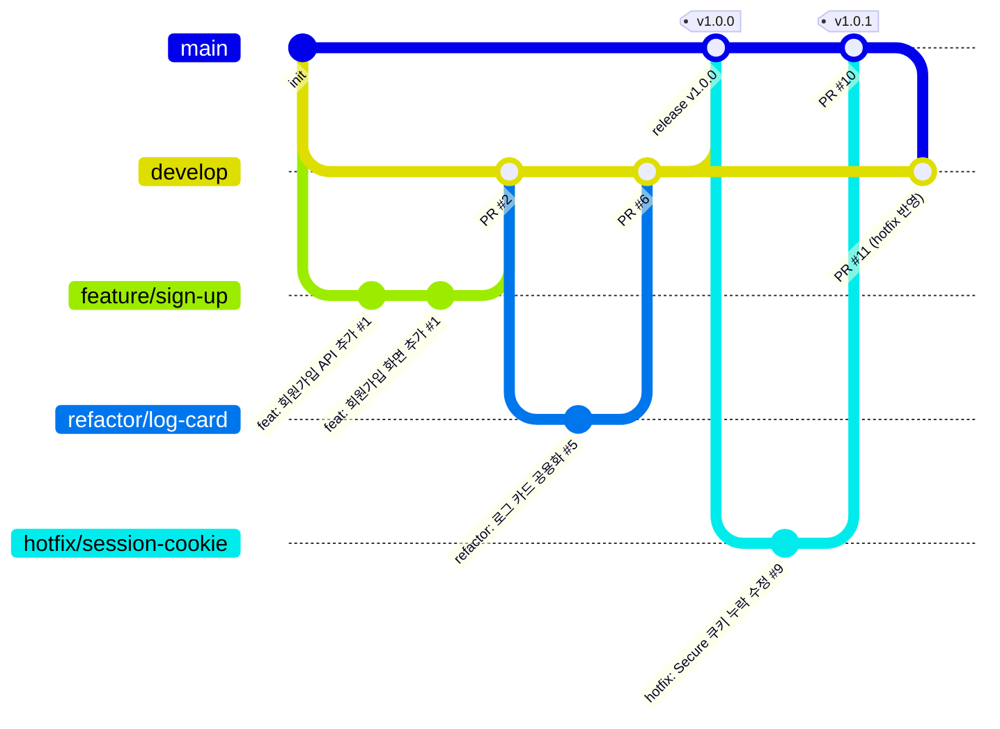

# 09. 팀 규칙 · 역할 분담 계획

팀: **성원모, 박성현, 이성준** (3인, 120시간 Term Project)

## 1. mission 이 강제하는 필수 규칙 (위반 시 감점)

| # | 규칙 | 근거 | 확인 방법 |
|---|------|------|-----------|
| R1 | **브랜치 전략 적용**: `main` / `develop` 분리 | §4-7 | `git branch -a` |
| R2 | **기능 단위 작업 브랜치**에서 작업 (`feature/*` 등, 긴급 수정은 `hotfix/*`) | §4-7 | `git log --graph --all` |
| R3 | **PR 기반 Merge** — 모든 병합은 GitHub PR 로만, 브랜치/PR 기록을 저장소에 남긴다 (브랜치 삭제는 해도 PR 기록은 남음) | §4-7, §6 | `git log --merges`, GitHub PR 목록 |
| R4 | **팀원별 유의미한 커밋 10회 이상** | §4-7, §6 | `git shortlog -sn` |
| R5 | 문서에 **팀 역할 / 개인별 작업 요약** 포함, **Git 이력과 모순 없게** | §2-2, §4-7, §6 | README §6 ↔ shortlog |
| R6 | API 키·DB 비밀번호 등 **민감정보를 코드/문서에 직접 작성 금지** | §6 | `grep`, PR 리뷰 |
| R7 | 모든 민감정보는 **환경 변수(.env)** 로 관리, `.env` 는 **.gitignore** | §6 | `git ls-files` |
| R8 | README 에 **환경 변수 키 목록(이름)과 설정 방법** | §6 | README §5 |
| R9 | AI 호출 **타임아웃** 설정 + 실패 시 **오류 안내** 반환 | §6 | pytest V40 |
| R10 | 요청 수신 · AI 호출/응답 · DB 저장 성공/실패 **로그** 유지 | §6 | pytest V60 |
| R11 | 평가 시점 **외부 네트워크 접속 가능** 상태 유지 | §4-6 | 외부망 E2E |

## 2. 브랜치 전략 · 커밋 컨벤션

> v0.2 — PR 작성 규칙은 [docs/10-pull-request.md](10-pull-request.md)
>
> | 결정 사항 | 상태 |
> |-----------|------|
> | 이슈 번호 표기 `#1` (앞자리 0 없음) | ✅ 확정 |
> | PR 머지 방식 Merge commit (Squash·Rebase 금지) | ✅ 확정 |
> | 별도 `design`·`rename`·`remove` 타입 없음 → UI·CSS 변경, 파일 이름 변경·삭제는 **`refactor`** 로 통일 | ✅ 확정 |

### 2-1. 브랜치 구조

| 브랜치 | 분기 기준 | 병합 대상 | 용도 | 직접 push |
|--------|-----------|-----------|------|:---------:|
| `main` | – | – | 평가·배포되는 안정 버전. 릴리스마다 태그(`v1.0.0`) | ❌ |
| `develop` | `main` (최초 1회) | `main` (릴리스 PR) | 다음 릴리스를 모으는 통합 브랜치 | ❌ |
| `feature/*` | `develop` | `develop` | 새 기능 구현 | – |
| `refactor/*` | `develop` | `develop` | 동작 변경 없는 구조 개선 | – |
| `fix/*` | `develop` | `develop` | 개발 중 발견한 버그 수정 | – |
| `docs/*` · `chore/*` · `test/*` | `develop` | `develop` | 문서 / 설정·빌드·배포 / 테스트 | – |
| `hotfix/*` | **`main`** | **`main`** → 이후 `develop` 에도 반영 | 배포(평가) 환경의 **긴급** 버그 수정 | – |



### 2-2. 브랜치 이름 규칙

형식: **`<type>/<작업-요약>`**
- 영문 **소문자 + 하이픈(kebab-case)**, 2~4 단어, 한글·공백·언더스코어 금지
- `type` 은 커밋 타입과 맞춘다 (`feature` ↔ `feat`)
- 이슈 번호를 붙이고 싶으면 앞에: `feature/12-sign-up` (선택)

| 좋은 예 | 나쁜 예 | 이유 |
|---------|---------|------|
| `feature/sign-up` | `feature/SignUp`, `feature/회원가입` | 대문자·한글 |
| `feature/chat-context` | `feature/chat` | 무엇을 하는지 불명확 |
| `refactor/log-card` | `feature/refactoring` | type 불일치 |
| `hotfix/session-cookie` | `fix/urgent` | 긴급 운영 수정은 hotfix, 내용 불명확 |
| `docs/api-spec` | `jun-work` | type·내용 없음 |

### 2-3. 작업 흐름 (PR 연동)

**일반 작업 (feature · refactor · fix · docs …)**
```bash
# 1) 이슈 생성 (GitHub Issues) → 번호 확인 (예: #1)
# 2) 최신 develop 에서 분기
git switch develop && git pull origin develop
git switch -c feature/sign-up

# 3) 작업하며 커밋 (2-4 컨벤션)
git commit -m "feat: 회원가입 API 추가 #1"

# 4) 원격에 올리고 PR 생성 (base: develop)
git push -u origin feature/sign-up
gh pr create --base develop --title "feat: 회원가입 기능 추가 #1"   # 또는 GitHub 화면에서 생성

# 5) 리뷰 반영 커밋 → 승인 1 → 작성자가 Merge commit 으로 머지 → 브랜치 삭제
# 6) 로컬 정리
git switch develop && git pull origin develop && git branch -d feature/sign-up
```

**긴급 수정 (hotfix)**
```bash
git switch main && git pull origin main
git switch -c hotfix/session-cookie
git commit -m "hotfix: 운영 세션 쿠키 Secure 누락 수정 #9"
git push -u origin hotfix/session-cookie
gh pr create --base main --title "hotfix: 운영 세션 쿠키 Secure 누락 수정 #9"
# 머지 후 태그 + develop 역반영 (빠뜨리면 다음 릴리스에서 버그 재발)
git switch main && git pull && git tag v1.0.1 && git push origin v1.0.1
gh pr create --base develop --head main --title "chore: v1.0.1 hotfix develop 반영"
```

**릴리스 (develop → main)**
- 평가·배포 시점에 `develop → main` PR, 머지 후 태그 `vMAJOR.MINOR.PATCH`
- 기능 묶음 릴리스는 MINOR(`v1.1.0`), hotfix 는 PATCH(`v1.0.1`)

**보호 규칙 (GitHub → Settings → Branches)**: `main`, `develop` 에
Require a pull request before merging · Require approvals **1** · Do not allow bypassing

### 2-4. 커밋 메시지 컨벤션

**형식**
```
<type>: <제목> #<이슈번호>

<본문 (선택): 무엇을, 왜 — 72자 줄바꿈>
```

**예시**
```
docs: v1.0 기본 문서 추가
feat: 로그인 기능 추가 #1
feat: 최근 5턴 대화 컨텍스트 적용 #7
fix: 한글 입력 중 Enter 중복 전송 수정 #14
refactor: 대화 로그 카드 컴포넌트 분리 #18
test: AI 타임아웃 503 응답 테스트 추가 #9
hotfix: 운영 세션 쿠키 Secure 누락 수정 #21
```

**타입**
| type | 사용 | 브랜치 |
|------|------|--------|
| `feat` | 새 기능 추가 | `feature/*` |
| `fix` | 버그 수정 | `fix/*` |
| `hotfix` | 배포 환경 긴급 수정 | `hotfix/*` |
| `refactor` | 동작 변경 없는 코드 구조 개선 **+ UI·CSS 디자인 변경 + 파일·폴더 이름 변경/삭제** | `refactor/*` |
| `docs` | 문서 추가·수정 (README, docs/*) | `docs/*` |
| `test` | 테스트 추가·수정 | `test/*` 또는 기능 브랜치 |
| `style` | 코드 포맷·세미콜론 등 (동작·UI 변경 없음) | 기능 브랜치 |
| `chore` | 빌드·패키지·설정·배포 스크립트 | `chore/*` |

> 타입은 위 9개만 사용한다. 디자인 변경(`refactor: 로그 카드 여백 조정`), 이름 변경(`refactor: LogsPage 컴포넌트 파일명 변경`), 삭제(`refactor: 미사용 스타일 삭제`)는 모두 `refactor`.

**제목 규칙**
1. `type` 은 **영문 소문자**, 콜론 뒤 **한 칸 띄움** (`feat: …`)
2. 제목은 **한국어**, **50자 이내**, 끝에 마침표 없음
3. "~ 추가 / 수정 / 삭제 / 분리 / 적용"처럼 **무엇을 했는지** 명사형으로 끝낸다
4. 이슈가 있으면 끝에 **`#번호`** (이슈 없는 문서·설정 작업은 생략 가능)
   - **`#1`, `#14` 처럼 앞자리 0 없이 쓴다** (확정). `#01` 형식은 쓰지 않는다 — GitHub 이슈 자동 링크 일관성
5. 버전 문서는 제목에 버전 표기: `docs: v1.0 기본 문서 추가`

**본문 (선택)** — 제목만으로 이유가 드러나지 않을 때
```
fix: 챗 진입 직후 전송한 메시지 사라짐 수정 #14

이전 대화 복원 응답이 늦게 도착하면 현재 메시지를 덮어쓰던 문제.
복원 결과를 현재 메시지 앞에 병합하도록 변경.
```

### 2-5. "유의미한 커밋" 기준 (R4)

mission 은 "유의미한" 커밋 10회를 요구하므로 아래는 **세지 않는다**고 팀 내 합의한다.
- 오타 1글자, 공백·포맷만, 빈 커밋, 같은 내용 되돌리기 반복, 파일 1개를 쪼개 여러 번 올리기

**좋은 커밋 = 하나의 논리적 변경 + 동작하는 상태 + 컨벤션을 지킨 메시지**

- 커밋 author 이메일은 **본인 GitHub 계정 이메일** (`git config user.email`) → shortlog 집계 정확
- 페어 작업 시 커밋 본문 끝에 `Co-authored-by: 이름 <이메일>`
- PR 머지는 **Merge commit 으로 확정** (Squash·Rebase 금지 → 개인 커밋과 머지 기록이 모두 남도록) — 상세 docs/10
  - GitHub 설정: Settings → General → Pull Requests 에서 **Allow merge commits 만 체크**, Squash·Rebase merging 해제

### 2-6. 기타
- 매일 짧은 스탠드업(어제/오늘/막힘), 작업은 **이슈 → 브랜치 → PR** 순서로 연결
- `.env` 값 공유는 저장소/채팅 평문 금지 → 직접 전달 또는 비밀 공유 도구
- 충돌 방지: 작업 시작 전 `git pull origin develop`, 공용 파일(`main.py`, `styles.css`) 수정 시 채널에 공지

## 3. 역할 분담

**원칙**: 기능을 **세로(백엔드+프론트) 단위**로 나눠 각자 끝까지 책임지고, 모든 팀원이 백엔드·프론트·테스트·문서 커밋을 고르게 갖게 한다. (역할 문서와 Git 이력 일치가 쉬움)

| 팀원 | 역할 | 담당 범위 (features.md #) | 산출물 |
|------|------|---------------------------|--------|
| **성원모** | 인증 · 보안 · 권한 리드 | B3~B6, **B15(관리자 API·권한)**, F2~F5, CSRF/Origin 검사 | `routers/auth.py`, `security.py`, `deps.py`(require_admin), `routers/admin.py`, `AuthPage.jsx`, `auth.jsx`, `App.jsx` 가드(RequireAdmin 포함), 인증·관리자 테스트 V10~V15·V80~V91, docs/02 §3-7·§4 |
| **박성현** | 챗봇 파이프라인 리드 | B7~B11, B13, F6~F8 | `routers/chat.py`, `ai_client.py`, `errors.py`, `logging_config.py`, `ChatPage.jsx`, 챗/장애/로그 테스트 V20~V42·V60~V61, docs/03 |
| **이성준** | 기반 · 데이터 · 배포 · 문서 리드 | B1, B2, B12, B14, F1, F9, **F10(관리자 화면)**, C1~C3, 로그 화면 | `main.py`(시드), `config.py`, `database.py`(migrate_schema), `models.py`(role), `routers/me.py`, `LogsPage.jsx`, `LogCard.jsx`, `AdminPage.jsx`, `Header/Footer`, `styles.css`, `deploy/*`, E2E 스크립트·UI 테스트, README, docs/01·04·05·06·07·08 |

공통: 코드 리뷰는 **순환**(성원모→박성현→이성준→성원모), 최종 통합 테스트·평가 리허설은 3명 함께.

## 4. 브랜치·커밋 계획 (팀원별 10회 이상 보장)

이슈 번호는 예시 (실제 GitHub Issues 생성 순서대로 부여). 모든 브랜치는 `develop` 에서 분기해 `develop` 으로 PR.

### 성원모 (계획 16 커밋)
| 이슈 · 브랜치 | 커밋 |
|---------------|------|
| #2 `feature/password-hash` | 1 `feat: bcrypt 비밀번호 해시 유틸 추가 #2` · 2 `feat: 세션 테이블 모델 추가 #2` |
| #3 `feature/sign-up` | 3 `feat: 회원가입 API 및 중복 아이디 처리 추가 #3` |
| #4 `feature/login-session` | 4 `feat: 로그인 세션 발급 및 HttpOnly 쿠키 적용 #4` · 5 `feat: 로그아웃 시 서버 세션 삭제 추가 #4` · 6 `feat: 로그인 사용자 확인 의존성 및 만료 처리 추가 #4` |
| #5 `feature/csrf-origin` | 7 `feat: 상태 변경 요청 Origin 검사 추가 #5` |
| #6 `feature/auth-page` | 8 `feat: 로그인 및 회원가입 화면 추가 #6` · 9 `feat: 새로고침 시 세션 복원 추가 #6` · 10 `feat: 비로그인 라우트 가드 추가 #6` · 11 `feat: 401 응답 시 로그인 화면 이동 추가 #6` |
| #7 `test/auth` | 12 `test: 가입·로그인·접근 제어·로그아웃 테스트 추가 #7` |
| – `docs/auth-decision` | 13 `docs: 세션 방식 선택 근거 추가` |
| #22 `feature/admin-api` | 14 `feat: 사용자 역할 및 관리자 권한 검사 추가 #22` · 15 `feat: 관리자 사용자 목록 및 대화 조회 API 추가 #22` · 16 `test: 관리자 권한 차단 및 강등 반영 테스트 추가 #22` |

### 박성현 (계획 14 커밋)
| 이슈 · 브랜치 | 커밋 |
|---------------|------|
| #8 `feature/ai-client` | 1 `feat: mock AI 공급자 추가 #8` · 2 `feat: Claude API 연동 추가 #8` · 3 `feat: AI 호출 타임아웃 및 예외 변환 추가 #8` |
| #9 `feature/chat-api` | 4 `feat: 챗 질문 수신 및 응답 API 추가 #9` · 5 `feat: 질문 공백 및 길이 검증 추가 #9` · 6 `feat: 최근 5턴 대화 컨텍스트 적용 #9` · 7 `feat: 실패 요청 기록 저장 추가 #9` |
| #10 `feature/server-log` | 8 `feat: 요청 ID 미들웨어 및 구조화 로그 추가 #10` · 9 `feat: AI 및 DB 이벤트 로그 추가 #10` · 10 `refactor: 오류 응답 형식 통일 #10` |
| #11 `feature/chat-page` | 11 `feat: 챗 말풍선 및 로딩 표시 추가 #11` · 12 `feat: 오류 말풍선 및 응답 시뮬레이션 추가 #11` · 13 `fix: 한글 입력 중 Enter 중복 전송 수정 #11` |
| #12 `test/chat` | 14 `test: 컨텍스트·타임아웃·저장 실패 테스트 추가 #12` |

### 이성준 (계획 18 커밋)
| 이슈 · 브랜치 | 커밋 |
|---------------|------|
| #1 `chore/project-init` | 1 `chore: 저장소 구조 및 환경 변수 예시 추가 #1` · 2 `chore: FastAPI 앱 골격 및 health API 추가 #1` · 3 `chore: React 프로젝트 및 API 프록시 설정 #1` |
| #13 `feature/database` | 4 `feat: DB 엔진 및 사용자·대화 로그 모델 추가 #13` · 5 `feat: 내 대화 로그 조회 API 추가 #13` · 6 `feat: 사용자별 서버 로그 API 추가 #13` · 7 `chore: 로그 확인용 SQL 스크립트 추가 #13` |
| #14 `feature/layout` | 8 `refactor: 디자인 토큰 및 헤더·푸터 스타일 적용 #14` · 9 `feat: 내 대화 로그 화면 추가 #14` · 10 `feat: 챗 진입 시 이전 대화 복원 추가 #14` |
| #15 `chore/deploy` | 11 `chore: Nginx 및 systemd 배포 설정 추가 #15` · 12 `test: 사용자 흐름 E2E 스크립트 추가 #15` |
| – `docs/v1.0` | 13 `docs: v1.0 기본 문서 추가` · 14 `docs: 검증 결과 및 역할 요약 갱신` |
| #23 `feature/admin-page` | 15 `feat: 역할 컬럼 마이그레이션 및 관리자 시드 추가 #23` · 16 `refactor: 대화 로그 카드 컴포넌트 분리 #23` · 17 `feat: 관리자 사용자별 대화 조회 화면 추가 #23` · 18 `test: 관리자 화면 UI 테스트 추가 #23` |

> 이 PoC 코드는 위 계획의 **참조 구현**이다. 팀은 각자 브랜치에서 해당 부분을 직접 이해·수정·재작성하며 커밋해야 한다 (한 번에 통째로 올리면 R2~R5 를 충족하지 못함).

## 5. 일정 (120시간 기준 제안)

| 주차 | 목표 | 완료 기준 |
|------|------|-----------|
| 1 | 저장소·브랜치·골격, 인증 API, AI mock, DB 모델 | develop 에서 가입→로그인→mock 챗 curl 성공 |
| 2 | 챗 파이프라인(컨텍스트·검증·타임아웃·로그), 프론트 화면, 관리자 기능 | pytest 통과, 브라우저 B01~B26 |
| 3 | 실제 Claude 연동, 배포(VM·Nginx·HTTPS), E2E 외부망, `develop → main` 릴리스 `v1.0.0` | 외부 URL 에서 E2E FAIL=0 |
| 4 | 문서 마감, 역할 요약·커밋 수 반영, 평가 리허설 | docs/08 §3 체크리스트 전부 체크 |

## 6. 개인별 작업 요약 (마감 시 실제 값으로 갱신)

| 팀원 | 역할 | 주요 작업 | 커밋 수 | PR |
|------|------|-----------|:------:|:--:|
| 성원모 | 인증·보안·권한 | _(실제 작업 기입)_ | _ | _ |
| 박성현 | 챗봇 파이프라인 | _(실제 작업 기입)_ | _ | _ |
| 이성준 | 기반·데이터·배포·문서 | _(실제 작업 기입)_ | _ | _ |

```bash
git shortlog -sn --no-merges          # 커밋 수 (머지 커밋 제외)
git log --merges --oneline            # PR 머지 기록
gh pr list --state merged --json number,title,author --limit 100
git log --oneline | grep -vE '^[0-9a-f]+ (Merge|(feat|fix|hotfix|refactor|docs|test|style|chore): )'   # 컨벤션 위반 커밋 찾기
```
